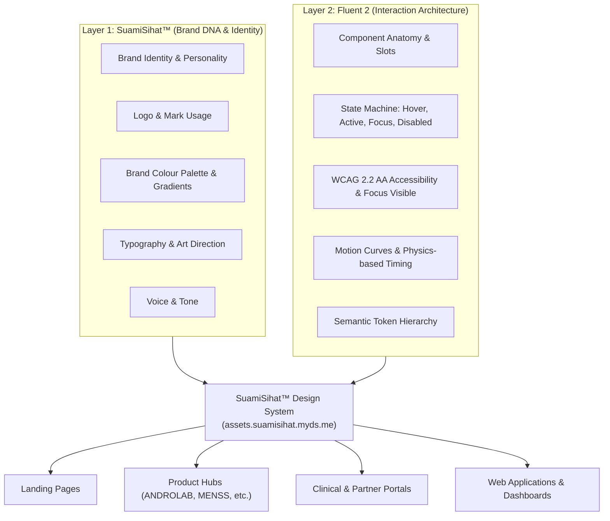

# Brand × Fluent 2 — Architectural Integration Contract

## Executive Overview

The SuamiSihat™ Design System operates on a strict **two-layer design architecture**:



### Core Axiom

> **"Fluent 2 provides the interaction system and structural logic. SuamiSihat provides the soul, visual identity, and clinical authority."**

This architectural separation completely resolves the two primary failure modes in multi-page and AI-assisted development:

1. **Prompt Dilution** — Developers and AI agents no longer spend prompt budget reproducing 3,000 words of design guidelines.
2. **Brand Drift** — Ensures future pages (landing pages, product hubs, clinical portals, checkout flows) never diverge in look, feel, or interactive behavior.

---

## 1. Source of Truth & Boundary Matrix

To prevent Fluent 2 from visually dominating SuamiSihat's distinct clinical-masculine character, every design decision is assigned to an authoritative source:

| Design Decision | Authoritative Source | Implementation Rule |
| --------------- | -------------------- | ------------------- |
| **Brand Personality** | **SuamiSihat™** | Confident, clinical, masculine, premium, discreet. |
| **Logo & Marks** | **SuamiSihat™** | Governed by background brightness rules (HSL L ≥ 50% vs L < 50%). |
| **Brand Palette & Accents** | **SuamiSihat™** | Prussian Blue (`#022057`), SS Blue (`#043388`), Azure (`#21A1F7`), Banana CTA (`#FCE53D`). |
| **Typography Stack** | **SuamiSihat™** | Outfit (Headings/Display) + Inter (Body & UI) with 4-Tier text hierarchy. |
| **Photography & Art Direction** | **SuamiSihat™** | Studio-lit packaging, dark-mode acrylic stages, high-contrast packshots. |
| **Voice & Tone** | **SuamiSihat™** | Authoritative medical backing, respectful, solution-oriented, non-stigmatizing. |
| **Component Anatomy** | **Fluent 2** | Standardized compound slots (icon start/end, content, action, badge). |
| **Interaction States** | **Fluent 2** | State machine: `rest`, `hover`, `pressed`, `selected`, `focused`, `disabled`. |
| **Focus Rings & A11y** | **Fluent 2 + WCAG** | High-contrast 2px offset outline (`var(--color-brand-primary)`). WCAG 2.2 AA compliant. |
| **Motion Principles** | **Fluent 2** | Fluent standard easing curves (`cubic-bezier(0.1, 0.9, 0.2, 1.0)` / fast 150ms–250ms). |
| **Responsive Grid** | **Fluent 2** | 12-column adaptive layout, 8px base spatial grid (`--f-space-*`). |
| **Semantic Token Methodology** | **Fluent 2 adapted for SS** | Global Tokens ➔ Semantic Alias Tokens ➔ Component Tokens. |

---

## 2. System Hierarchy & Precedence

When building components or full page templates, adhere to this strict hierarchy:

```text
                    SUAMISIHAT™
                 Brand Identity
                       │
                       ▼
              ┌─────────────────┐
              │  DESIGN SYSTEM  │
              │                 │
              │ SuamiSihat DNA  │
              │       ×         │
              │ Fluent 2 Rules  │
              └────────┬────────┘
                       │
                       ▼
              Components & Patterns
                       │
                       ▼
                 Experiences
```

1. **SuamiSihat Brand System** (Highest priority — colours, marks, typography, voice)
2. **SuamiSihat Design Tokens** (Semantic CSS custom properties)
3. **Fluent 2 Interaction and Component Principles** (State transitions, elevation, focus rings, accessibility)
4. **Page-Specific Requirements** (Content layouts, form flows, marketing blocks)

---

## 3. Information Architecture (`assets.suamisihat.myds.me`)

The SuamiSihat™ design system is structured into three clear tiers:

### 01. Foundation

*The global source of truth across all platforms:*

- **Introduction & Philosophy**
- **Brand Principles**
- **Brand × Fluent 2 Integration Rules** (This contract)
- **Colour & Gradients** (60:30:10 rule)
- **Typography** (4-Tier contrast scale)
- **Spacing & 8px Grid**
- **Elevation & Acrylic Depth**
- **Motion & Kinetic Energy**
- **Iconography** (Fluent System regular/filled)
- **Accessibility** (WCAG 2.2 AA standard)

### 02. Brand

*The dedicated brand identity and visual guidelines:*

- **Brand Overview & Positioning**
- **Brand Architecture** (Holding, Operating Subsidiaries, Partner Networks)
- **Logo & Logomark** (Safe zones, minimum sizes, math geometry)
- **Clear Space & Proportions**
- **Incorrect Usage & Violations**
- **Colour Application & Contrast Ratios**
- **Imagery & Studio Packshots**
- **Voice & Tone Guidelines**

### 03. Design System

*Reusable, production-grade UI assets:*

- **Design Tokens** (Global, Alias, Component)
- **Components** (`ss-hero`, buttons, cards, dialogs, inputs, tabs, badges)
- **Patterns** (Sticky sub-navigation, e-commerce cards, lightbox gallery, command palette)
- **Templates** (Landing page, Brand hub, Product spec, Campaign portal)

---

## 4. Semantic Token Pipeline

SuamiSihat uses Fluent 2's semantic token architecture adapted with SuamiSihat brand values:

```text
[Global Tokens]                   [Semantic Alias Tokens]            [Component Tokens]
--ss-prussian-blue: #022057  ──►  --color-brand-primary: var(...) ──► --ss-hero-bg
--ss-azure: #21A1F7          ──►  --color-brand-light: var(...)   ──► --btn-primary-bg
--ss-banana: #FCE53D         ──►  --color-brand-cta: var(...)     ──► --badge-sale-bg
--ss-neutral-black: #19191A  ──►  --text-primary: var(...)        ──► --card-title-color
--ss-neutral-white: #FCFAF6  ──►  --color-neutral-bg-1: var(...)  ──► --page-bg
```

---

## 5. 4-Tier Text Hierarchy & Surface Matrix

The design system enforces four levels of text emphasis across light and dark interfaces:

| Level | Token | Light Mode | Dark Mode | Role |
| ----- | ----- | ---------- | --------- | ---- |
| **Level 1 — Strong** | `--text-strong` | `#000000` | `#FFFFFF` | Maximum emphasis — H1, key numbers, prices, critical CTAs. |
| **Level 2 — Primary** | `--text-primary` | `#19191A` | `#FCFAF6` | Default readable content — body text, H2–H6, navigation. |
| **Level 3 — Secondary** | `--text-secondary` | `rgba(25, 25, 26, 0.65)` | `rgba(252, 250, 246, 0.65)` | Metadata, timestamps, helper subtitles. |
| **Level 4 — Disabled** | `--text-disabled` | `rgba(25, 25, 26, 0.35)` | `rgba(252, 250, 246, 0.35)` | Inactive buttons, disabled inputs. |
| **Inverse** | `--text-inverse` | `#FFFFFF` | `#000000` | Text on inverted buttons or contrasting overlays. |

> *"Black and white create emphasis. Carbon Black (`#19191A`) and Porcelain (`#FCFAF6`) create readability."*

---

## 6. Motion & Kinetic Energy Rules

Kinetic motion in SuamiSihat interfaces must embody biological vitality and technical precision:

- **Hero Banner Standard (`ss-hero`)**: Features a 2D interactive canvas wave (`#heroWaveCanvas`) with floating Mars `♂` symbols, radiant Azure `#21A1F7` & Gold `#F7E143` energy nodes, and gentle cursor parallax.
- **Fluent Motion Timing**:
  - Fast feedback (button press, hover): `150ms cubic-bezier(0.1, 0.9, 0.2, 1.0)`
  - Medium transitions (drawers, modals, dropdowns): `250ms cubic-bezier(0.16, 1, 0.3, 1)`
  - Ambient oscillations (glows, waves): `8000ms linear infinite`
- **Accessibility**: Strict compliance with `prefers-reduced-motion: reduce` (renders static glowing brand gradient).

---

## 7. Mandatory Source of Truth Block for AI & Page Prompts

When generating new pages, sub-products, or campaigns, include this concise, non-negotiable prompt block:

```markdown
### Design System — Mandatory Source of Truth
This page must be designed and built using the **SuamiSihat™ Brand & Design System** (`assets.suamisihat.myds.me`):
- **Visual Identity (SuamiSihat)**: Use established brand colours (`#043388`, `#022057`, `#21A1F7`, `#F7E143`), Outfit/Inter typography, 4-tier text contrast hierarchy (`--text-strong`, `--text-primary`, `--text-secondary`, `--text-disabled`), and brightness-aware SVG logo selection.
- **Interaction Layer (Fluent 2)**: All components, states (`hover`, `pressed`, `focus`), elevation levels, and spatial layouts follow Fluent 2 component specifications and accessibility contracts.
- **System Precedence**: SuamiSihat Brand DNA > Design Tokens > Fluent 2 Component Anatomy > Page Content.
```
