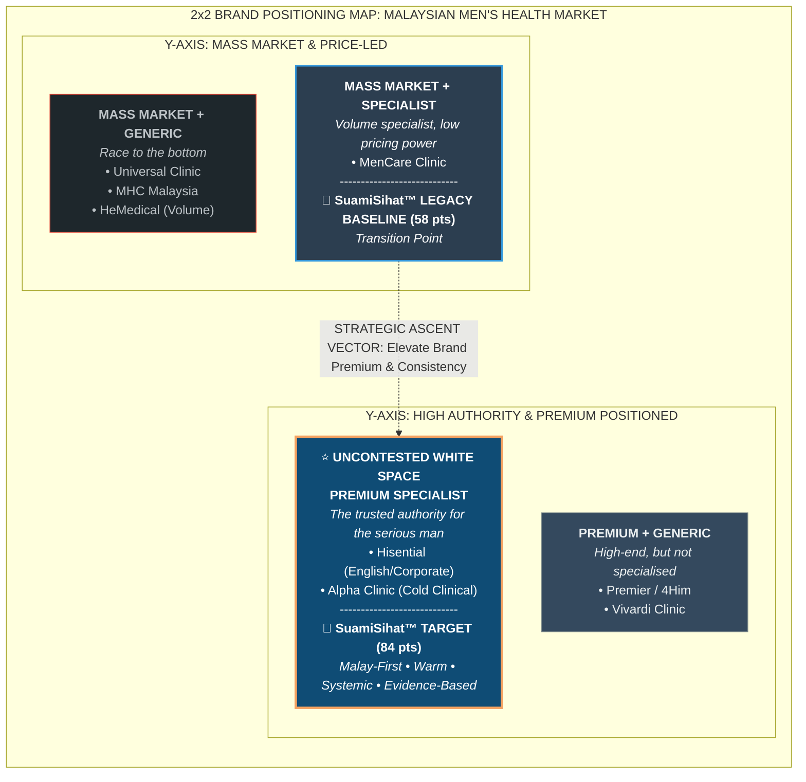
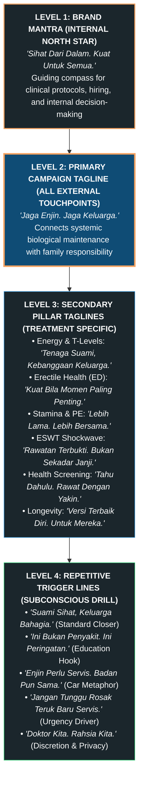
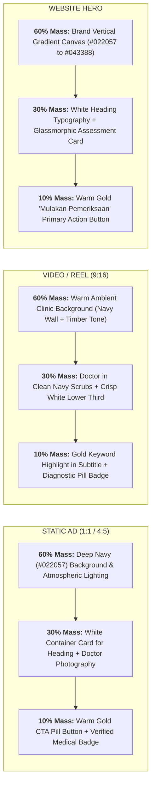
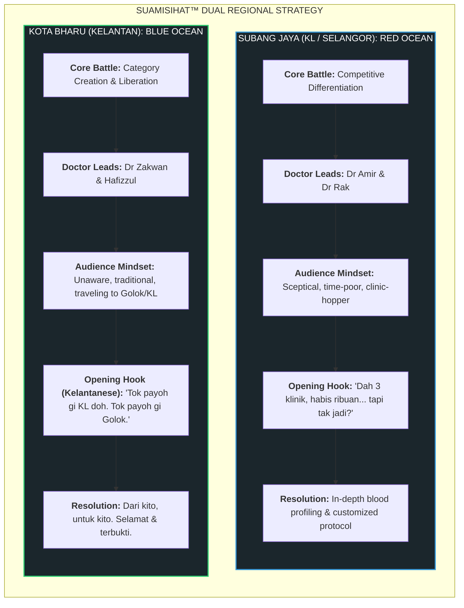
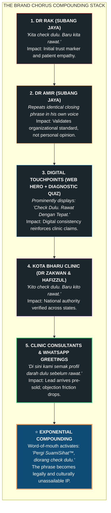

# SS Clinic Brand Positioning: Designer & Editor Playbook

**Document ID:** `SSC-STR-001`  
**Entity:** SuamiSihat Clinic Sdn. Bhd. (SSC)  
**Target Audience:** Creative Directors, UI/UX Designers, Motion Editors, Healthcare Copywriters  
**Classification:** Authoritative Design System Standard & Production Guide  
**Living Web Reference:** `https://assets.suamisihat.myds.me/doc/?doc=clinic-positioning`  

---

## Executive Summary: The Saturation Crisis & The White Space Opportunity

The Malaysian Men's Health clinic sector is trapped in destructive commoditisation. Competing clinics offer virtually identical clinical procedures (Erectile Dysfunction / ED, Premature Ejaculation / PE, ESWT Shockwave Therapy, and P-Shot / Penile Fillers), bid on identical search keywords, and deploy aggressive, symptom-shaming ad copy targeting the exact same male demographic.

```text
       COMMODITISED RED OCEAN                           SUAMISIHAT™ STRATEGIC LEAP
 [ Race to the bottom: Price wars ]          [ Premium Specialist: Uncontested territory ]
 [ Aggressive red & black shame ads ] =====> [ Deep navy & warm gold clinical dignity   ]
 [ "Mati pucuk" fear-mongering hooks ]       [ "Jaga Enjin. Jaga Keluarga."             ]
 [ Selling clinical procedures first ]       [ "Kami Tak Jual Rawatan, Kami Cari Punca" ]
```

### The Documented Competitor Landscape

| Competitor | Meta Ads Volume | Google Ads ID / Tracking | Core Copy Hook | Differentiation Level | Strategic Vulnerability |
| :--- | :--- | :--- | :--- | :--- | :--- |
| **HeMedical** | 190+ ads | `AW-10803392252` | *"Masalah Mati Pucuk"*, *"Lemah Batin"* | **Very Low** (Volume Play) | Pure ad spend brute force; severe brand fatigue; generic red visuals. |
| **Universal Clinic** | 32 ads | `AW-10987799107` | *"Free Consultation"*, RM discounts | **Very Low** (Price War) | Margin erosion; cheapens clinical authority; low customer lifetime value. |
| **Men's Health Clinic MY** | 25 ads | Direct Lead Forms | *"Mati Pucuk"*, *"Pancut Awal"* | **Very Low** (Symptom Shame) | Taboo exploitation; creates patient dread rather than trust. |
| **MenCare Clinic** | 13 ads | `GTM-KPFJL9T3` | Geo-targeting multi-branch | **Medium** (Branch Network) | Convenience-led only; lacks unified medical or brand philosophy. |
| **Alpha Clinic** | 21 ads | GTM Only | *"Andrology Certified"*, *"Privacy"* | **Medium** (Clinical Authority) | Cold, clinical persona; negligible ad reach; non-engaging doctor voice. |
| **Premier Clinic (4Him)** | Heavy Aesthetic | `GTM-TS2623T` | ZSR Sunat, aesthetic-first | **Medium** (Aesthetic Crossover) | Diluted men's health focus; viewed primarily as a cosmetic clinic. |
| **Vivardi Clinic** | Active | `GTM-MQ394QFG` | Penile fillers + aesthetics | **Medium** (Niche Procedure) | Hyper-focused on cosmetic enhancement; misses systemic wellness. |
| **Hisential Clinic** | 4 Evergreen | `GTM-N4XRD98` | *"Executive Wellness"*, concierge | **High** (Premium Tier) | English-only; Westernized niche; entirely excludes mainstream Malay men. |
| **SuamiSihat™ Clinic** | **70 ads (SJ + KB)** | `AW-10963518860` | *"Engine Overhaul"*, Diagnostic Quiz | **High** (**Market Leader Target**) | **Moat:** Proprietary diagnostic quiz, dual regional identity, brotherly medical authority. |

> [!IMPORTANT]
> **The Critical Market Insight:** 6 out of 8 competitors rely on identical keywords (*"mati pucuk"*, *"pancut awal"*, *"lemah batin"*) and race to the bottom on price. SuamiSihat™ cannot win by shouting louder in the same mud. Our defensible moat is owning an **emotional, identity-first, and diagnostic-led territory**.

---

## 2x2 Brand Positioning Map: The Uncontested White Space



### The 6 Critical Unoccupied Brand Moats

1. **Gap 01: Whole-System Identity Shift.** Competitors sell single-procedure fixes (shockwave, injections). Nobody addresses whole-body male vitality. SuamiSihat™ owns the *"Engine Overhaul"* systemic approach connecting vascular, hormonal, metabolic, and psychological health.
2. **Gap 02: Malay Premium Authority.** Hisential serves urban English-speaking executives; Alpha is clinically sterile. Nobody owns premium, dignified, educated men's health for Malay men. SuamiSihat's dual presence (**Subang Jaya + Kota Bharu**) anchors a unique national Malay footprint.
3. **Gap 03: Husband & Family Framing.** Competitors treat patients as isolated men with embarrassing dysfunctions. SuamiSihat™ anchors the journey around his role as a **husband, father, and provider** (*"Untuk isteri, keluarga, dan maruah suami"*).
4. **Gap 04: Diagnostic-First Brand Infrastructure.** Competitors push patients immediately to high-pressure WhatsApp sales chats. SuamiSihat™ guides leads through a clinical diagnostic assessment (**Ujian Skor Kesihatan Suami**) before recommending any treatment.
5. **Gap 05: Long-Term Health Lifecycle Partner.** Other clinics transact single appointments. SuamiSihat™ leverages its **14,000+ subscriber health newsletter**, ongoing diagnostic check-ins, and multi-stage care to accompany men from their late 30s through their 50s and beyond.
6. **Gap 06: Destigmatisation Without Trivialisation.** Competitors alternate between vulgar red shock ads (*"Mati Pucuk!"*) and cold medical jargon. SuamiSihat™ adopts a dignified, empathetic, brotherly tone: authoritative yet deeply human.

---

## Tagline Architecture & The Tagline Ladder



### The 4 Operational Verbal Assets

* **Primary Operational Tagline (All Touchpoints):**
  > **"Kami Tak Jual Rawatan. Kami Cari Punca."**  
  > *(We don't sell treatments. We find the root cause.)*

* **The 3-Point Brand Promise Stamp:**
  > **"Check Dulu. Rawat Dengan Tepat. Tiada Janji Palsu."**  
  > *(Use on website hero banners, pinned posts, WhatsApp bios, and clinic signage)*

* **Mandatory Verbal Video Outro Hook (Doctors' Video Close):**
  > **"Kita check dulu. Baru kita rawat."** (Subang Jaya / National)  
  > **"Kito check dulu. Baru kito rawat."** (Kota Bharu / East Coast)  
  > *(Mandatory in the final 3 seconds of EVERY doctor video, Reel, and TikTok)*

* **Empathy Ad Opener:**
  > **"Dah habis ribuan dekat klinik lain, tapi masih tak jadi?"**  
  > *(Validates patient frustration without shame; positions SuamiSihat™ as the honest medical antidote)*

---

## Part 1: Designer's Field Guide (Visual Art Direction & UI/UX Standards)

This section provides strict, non-negotiable art-direction specifications for graphic designers, digital art directors, and UI/UX engineers building assets for SuamiSihat™ Clinic.

### 01. The 60:30:10 Color Hierarchy & Token Specification

The 60:30:10 rule is an **art-direction heuristic for visual mass**. It guarantees that every asset communicates medical authority, premium refinement, and clinical hygiene.

```text
┌─────────────────────────────────────────────────────────────────────────────┐
│                        60:30:10 VISUAL MASS DISTRIBUTION                    │
├──────────────────────────────┬──────────────────────────────┬───────────────┤
│    60% FOUNDATION BASE       │    30% SECONDARY STRUCTURE   │ 10% ACCENT    │
│    Deep Navy Canvas          │    Clinical White & Slate    │ Warm Gold/Cyan│
│    #022057 / #0F4C75         │    #FFFFFF / #F8FAFC         │ #F4A261 / #21A│
│                              │                              │               │
│    Clinical Authority,       │    Sterile Hygiene, Content  │ CTAs, Badges, │
│    Trust, Male Dignity       │    Containers, Legibility    │ Conversions   │
└──────────────────────────────┴──────────────────────────────┴───────────────┘
```

#### Official Semantic Color Tokens

| Role | Color Name | Hex Code | Semantic Design Token | Usage Scope |
| :--- | :--- | :--- | :--- | :--- |
| **60% Foundation** | Deep Prussian Navy | `#022057` | `--color-brand-deep` | Master hero background, solid poster canvas, header panels. |
| **60% Foundation (Alt)** | Clinical Navy | `#0F4C75` | `--color-brand-primary` | In-clinic acrylic walls, video backdrops, gradient overlays. |
| **30% Structure** | Pure Clinical White | `#FFFFFF` | `--color-neutral-bg-1` | Content cards, data containers, main text on dark surfaces. |
| **30% Structure** | Sterile Off-White | `#F8FAFC` | `--color-neutral-bg-2` | Light web canvas, alternating table rows, card borders. |
| **30% Structure** | Slate Border | `#E2E8F0` | `--color-neutral-stroke-1` | Card dividers, subtle outline strokes, input field borders. |
| **10% Brand Accent** | Warm Clinic Gold | `#F4A261` | `--color-accent-gold` | Primary conversion CTAs (`MULAKAN PEMERIKSAAN`), star ratings, quiz highlight badges. |
| **10% Brand Accent (Alt)** | Azure Energy | `#21A1F7` | `--color-brand-light` | Digital active states, diagnostic wave pulses, verified ticks. |
| **Text Primary (Light)**| Neutral Black | `#1C1C1C` | `--color-neutral-fg-1` | High-contrast body and heading copy on white or light cards. |

> [!WARNING]
> **Strict Color Blacklist for Designers:**
> - ❌ **NEVER use Aggressive Alarm Red (`#FF0000` / `#DC2626`)** in ad banners, hero headers, or badges. Red triggers medical dread, shame, and associates our clinic with low-tier commoditised rivals.
> - ❌ **NEVER use Flash-Sale Hazard Yellow (`#FFFF00`)** or bright fluorescent green for promotional banners.
> - ❌ **NEVER use Harsh Pitch Black (`#000000`)** as a full flat background. Use Deep Prussian Navy (`#022057`) to preserve warmth and clinical depth.

#### Visual Mass Allocation Across Formats



---

### 02. Typography System & Type Scale

SuamiSihat™ typography pairs **editorial masculinity with digital precision**.

#### Font Pairings

- **Headlines & Display:** `Outfit` (Primary Display) or `'Segoe UI Variable Display'` (Windows Fluent 2 fallback). Bold, confident, human geometric sans-serif.
- **Body & Microcopy:** `Inter` (Universal UI Standard). Superb legibility at 12px to 16px, balanced numerical figures for clinical test readings.
- **Monospace & Code:** `Cascadia Code` / `Fira Code`. Used exclusively for clinical metrics, lab test values, and Document IDs.

#### Master Type Scale Table

| Level | Size (Desktop / Mobile) | Weight | Line Height | Tracking | Text Color Role |
| :--- | :--- | :--- | :--- | :--- | :--- |
| **Hero H1** | `44px` / `32px` | 800 (ExtraBold) | 1.15 | `-0.025em` | White (`#FFFFFF`) on Navy; Neutral Black (`#1C1C1C`) on Light. |
| **Section H2**| `28px` / `22px` | 700 (Bold) | 1.25 | `-0.02em` | Deep Navy (`#022057`) on Light; Pure White on Dark. |
| **Subhead H3**| `20px` / `18px` | 600 (SemiBold) | 1.35 | `-0.01em` | Clinical Navy (`#043388`) on Light; Azure (`#6DC6EC`) on Dark. |
| **Body Large**| `18px` / `16px` | 400 (Regular) | 1.75 | `0` | Charcoal Grey (`#334155`). |
| **Body Base** | `15px` / `14px` | 400 (Regular) | 1.70 | `0` | Charcoal Grey (`#334155`). |
| **Caption/Tag**| `12px` / `11px` | 600 (SemiBold) | 1.40 | `+0.05em` | Muted Slate (`#64748B`), Uppercase. |

---

### 03. Layout Grid, Corner Radius & Elevation Tokens

All visual assets must conform to Microsoft Fluent 2-aligned structural tokens:

* **Corner Radius:**
  - Cards & Posters: `12px` (`--f-radius-lg`).
  - Buttons & Interactive Pills: `9999px` (Full Pill) or `8px` (`--f-radius-md`).
  - Input Fields: `8px` (`--f-radius-md`).
* **Card Elevation & Shadow:**
  - Default Card: `box-shadow: 0 4px 16px rgba(2, 32, 87, 0.08);`
  - Hover / Active Card: `box-shadow: 0 8px 24px rgba(2, 32, 87, 0.14);`
* **Safe Padding Margins:**
  - 1:1 Static Ads: Minimum `64px` safe margin on all edges.
  - 9:16 Video / Reels: Keep all text overlays inside the central `1080 x 1350 px` safe zone (clear of top status bar and bottom TikTok caption drawer).

---

### 04. Photography & Art Direction: The Casting & Staging Doctrine

```text
┌─────────────────────────────────────────────────────────────────────────────┐
│                      PHOTOGRAPHY CASTING & STAGING DOCTRINE                 │
├──────────────────────────────────────┬──────────────────────────────────────┤
│ ✅ APPROVED SUAMISIHAT™ VISUALS      │ ❌ STRICTLY BANNED VISUAL CLICHÉS    │
├──────────────────────────────────────┼──────────────────────────────────────┤
│ • Dignified Malaysian men (32–55 yo) │ • Distressed men clutching forehead  │
│ • Natural smiles, upright posture    │ • Dark, depressing, gloomy bedrooms  │
│ • Warm eye contact, calm composure   │ • Aggressive bodybuilders / gym bros │
│ • Doctors in modern navy scrubs      │ • Cold, sterile hospital white gowns │
│ • Warm clinic lounge lighting (3000K)│ • Harsh blue/green fluorescent lamps │
│ • Genuine doctor-patient dialogue    │ • Explicit anatomical cross-sections │
│ • High-end diagnostic equipment      │ • Fake pill bottles or loose tablets │
└──────────────────────────────────────┴──────────────────────────────────────┘
```

#### Approved Photography Styles
1. **The Modern Husband Portrait:** Authentic Malaysian men (Malay, Chinese, Indian) engaged in real-life moments: enjoying breakfast with family, driving, working at an executive desk, or sharing coffee. He is confident, respected, and proactive about his health.
2. **The Attentive Physician Portrait:** Doctors (Dr Amir, Dr Rak, Dr Zakwan) photographed in warm, modern clinic consultation suites. Posture is open, listening, and empathetic. Attire: Tailored navy clinical scrubs or crisp modern white consultation coats with embroidered SuamiSihat™ insignia.
3. **The Diagnostic Ritual:** Macro photography of high-precision diagnostic tools: digital blood pressure monitors, centrifugal lab tubes, ESWT acoustic handpieces held with professional precision. Focus on the **scientific credibility of diagnosis**.

---

## Part 2: Editor & Copywriter Playbook (Verbal Identity & Messaging Engine)

This section provides strict editorial guidelines, regulatory guardrails, and complete copy swipe files for copywriters, ad scriptwriters, and communications specialists.

### 01. The Brand Voice Matrix: Modern Masculine Healthcare

SuamiSihat™ operates under one foundational standard: **MASCULINE ≠ MACHO**.

```text
┌─────────────────────────────────────────────────────────────────────────────┐
│                        BRAND VOICE BOUNDARY MATRIX                          │
├──────────────────────────────────────┬──────────────────────────────────────┤
│ WHAT SUAMISIHAT™ IS                  │ WHAT SUAMISIHAT™ IS NOT              │
├──────────────────────────────────────┼──────────────────────────────────────┤
│ [ Warm, brotherly, respected peer  ] │ [ Cold, clinical, preaching doctor ] │
│ [ Educated, conversational Malay   ] │ [ Rigid archaic BM or crude slang  ] │
│ [ "Sinyal semulajadi badan..."     ] │ [ "MATI PUCUK?! RAWAT SEGERA!"     ] │
│ [ Systemic engine optimisation     ] │ [ Deficit fixing & performance panic]│
│ [ "Seorang suami bertanggungjawab" ] │ [ "A patient with sexual dysfunction"]│
│ [ "Mulakan Pemeriksaan Awal"       ] │ [ "Cepat book! Tinggal 2 slot!"    ] │
│ [ Evidence-grounded root cause     ] │ [ Unsubstantiated miracle cures    ] │
└──────────────────────────────────────┴──────────────────────────────────────┘
```

---

### 02. Ministry of Health (MOH) & Regulatory Compliance Guardrails

As a registered clinical healthcare provider in Malaysia, all copy must comply with **KKM/MOH, Akta Kemudahan dan Perkhidmatan Jagaan Kesihatan Swasta 1998 (Act 586)**, and NPRA advertising standards.

> [!CAUTION]
> **Zero Tolerance Legal Violations:**
> 1. **Never promise 100% cure rates or absolute guarantees** (*"Dijamin sembuh 100%"* is illegal).
> 2. **Never claim instantaneous speed** (*"Keras dalam 1 sesi"*, *"Kesan serta-merta dalam 24 jam"* are prohibited).
> 3. **Never deploy false urgency** (*"Tinggal 2 slot sahaja lagi!"* destroys clinical credibility and violates advertising ethics).

#### Prohibited Terms vs. Approved Clinical Terminology

| Prohibited Term (Blacklisted) | Violation Category | Approved SuamiSihat™ Replacement |
| :--- | :--- | :--- |
| ❌ *"Mati pucuk"* | Taboo shame trigger | ✅ **"Penurunan vitaliti lelaki"** or **"Cabaran ereksi semulajadi"** |
| ❌ *"Lemah batin"* | Emasculating slang | ✅ **"Kesihatan intim lelaki"** or **"Tahap hormon dan tenaga"** |
| ❌ *"Pancut awal"* | Vulgar shock trigger | ✅ **"Kawalan stamina dan daya tahan"** |
| ❌ *"Keras macam besi"* | Macho hyperbole | ✅ **"Fungsi vaskular yang optimum"** |
| ❌ *"Fitrah"* (in ad copy) | Theological mismatch | ✅ **"Semulajadi"** (e.g., *"Sinyal semulajadi badan"*)|
| ❌ Em-dash (`—`) | Punctuation violation | ✅ Use colons, commas, or clean line breaks |

---

### 03. The Two Regional Playbooks: Subang Jaya vs. Kota Bharu

SuamiSihat™ operates two distinct flagship clinics. The brand spine is identical, but the audience psychology and vernacular dial are precisely calibrated.



#### Regional Comparison Matrix

| Operational Dimension | Subang Jaya Clinic (Dr Rak & Dr Amir) | Kota Bharu Clinic (Dr Zakwan & Hafizzul) |
| :--- | :--- | :--- |
| **Market Category** | **Red Ocean:** Saturated with 8 competitors in Klang Valley. | **Blue Ocean:** Modern men's health clinic category is brand new. |
| **Primary Objective** | Contrast SuamiSihat™ against bad competitor experiences. | Create the category; establish first-mover medical trust. |
| **Emotional Trigger** | Relief from clinical failure, wasted money, and overselling. | Local pride, safe alternative to Golok black market, proximity. |
| **Language Register** | Educated, conversational urban Malay with natural English terms. | **Authentic Kelantanese dialect** (*Kecek Kelate*). |
| **Opening Hook** | *"Dah habis ribuan dekat klinik lain, tapi masih tak jadi?"* | *"Tok payoh gi KL doh. Tok payoh gi Golok."* |
| **Closing Tagline** | *"Kita check dulu. Baru kita rawat."* | *"Kito check dulu. Baru kito rawat. Dari Kelate, untuk Kelate."* |
| **Sign-Off Line** | *"Suami Sihat, Keluarga Bahagia."* | *"Suami Sihat, Keluarga Bahagia. Dari kito, untuk kito."* |

---

### 04. Subang Jaya Script & Content Formula (Urban Malay)

#### The 5-Step Story Narrative Formula
1. **The Empathetic Hook (0-5s):** Validate previous clinical frustration without judgment.
2. **The Industry Diagnosis (5-15s):** Expose why previous treatments failed: other clinics rushed to sell procedures to meet sales commissions.
3. **The SuamiSihat™ Distinction (15-30s):** Highlight comprehensive diagnostic profiling (vascular flow, hormonal balance, lipid profile).
4. **The Customized Match (30-45s):** Explain that treatments are matched to his biology, goals (*kehendak*), and budget.
5. **The Brand Chorus Close (45-60s):** Mandatory closing tagline: *"Kita check dulu. Baru kita rawat."*

#### Subang Jaya Full Doctor Video Script (60 Seconds)

```text
[VIDEO OPEN: Dr Rak or Dr Amir seated in warm clinic lounge, looking directly into camera]

Dr: "Ramai pesakit yang datang jumpa saya di Subang Jaya mengadu benda yang sama:
'Doktor, saya dah pergi tiga klinik lain. Dah habis beribu ringgit. Tapi masalah saya masih tak selesai.'

Tahu kenapa?
Sebab kebanyakan klinik di luar sana, mereka jual rawatan dulu.
Mereka belum sempat semak darah dan hormon anda, mereka dah cadangkan pakej rawatan beribu ringgit.

Di SuamiSihat™, cara kami berbeza.
Kami tak jual rawatan. Kami cari punca.

Sebelum kita bincang sebarang prosedur, kita semak dulu profil kesihatan anda secara mendalam:
tahap testosteron, aliran darah vaskular, dan kesihatan metabolik anda.
Bila kita dah tahu bacaan sebenar, baru kita duduk sama-sama dan rancang rawatan yang betul-betul padan dengan badan anda, dan bajet anda.

Tak ada janji palsu. Tak ada rawatan yang tak perlu.

Ingat: Kita check dulu. Baru kita rawat."

[OUTRO CARD: SuamiSihat™ Clinic Subang Jaya | 'Kita check dulu. Baru kita rawat.']
```

---

### 05. Kota Bharu Script & Content Formula (Kelantanese Dialect)

> [!NOTE]
> **Why the Dialect is an Unfair Competitive Advantage:**
> Any national clinic chain can run social media ads in Kelantan. But only a local Kelantanese doctor authentically saying *"Tok payoh gi Golok doh"* can connect with decades of lived experience: risky clandestine trips across the border, unsafe black-market medication, high travel expenses, and personal shame. No KL-based competitor can duplicate this cultural bond.

#### Kota Bharu Dialect Glossary (Verified Reference for Editors)

* *Tok payoh* = Tak perlu (No need)  
* *Kito* = Kita (Us / We)  
* *Doh ado* = Dah ada (Already here)  
* *Tok tentu* = Tidak pasti (Uncertain)  
* *Hok* = Yang (Which / That)  
* *Nok* = Hendak / Mahu (Want to)  
* *Pulok* = Pula (Also / Again)  
* *Bahayo* = Bahaya (Dangerous)  
* *Sek kito* = Kaum kita / Orang kita (Our community)  

#### Kota Bharu Full Doctor Video Script (60 Seconds)

```text
[VIDEO OPEN: Dr Zakwan or Hafizzul in Kota Bharu clinic suite, warm lighting, natural Kelantanese cadence]

Dr: "Ramai ore jate kito di Kelate tok tahu lagi:
kat Kota Bharu ni, doh ado klinik khusus untuk kesihatan dan vitaliti lelaki.

Selamo ni, ramai kene gi KL jauh-jauh.
Atau hok lagi bahayo: gi Golok, gi cari ubat tepi jalan hok tok tentu selamat, tok tentu doktor betul.
Kesan mungkin ado sekejap, lepas tu rosak badan.

Loni, tok payoh doh.
Tok payoh gi KL. Tok payoh gi Golok doh.

Di SuamiSihat™ Kota Bharu, kito sediakan rawatan bertauliah, selamat, dan berpatutan betul-betul untuk sek kito.
Kito semak profil darah dan hormon dulu.
Kito tengok punca gapo hok sangkut.
Lepas tu baru kito cadang rawatan hok betul-betul padan dengan badan dan bajet demo.

Selamat. Rahsia terjamin. Bertauliah.

Kito check dulu. Baru kito rawat.
Dari kito, untuk kito."

[OUTRO CARD: SuamiSihat™ Clinic Kota Bharu | 'Kito check dulu. Baru kito rawat. Dari kito, untuk kito.']
```

---

### 06. The Brand Chorus: Repetition as an Unfair Advantage



#### Cognitive Psychology: The Power of Pattern Recognition

When a prospective patient encounters the exact same core truth expressed independently by multiple medical professionals across diverse touchpoints, the subconscious mind stops evaluating the message as advertising and stores it as **established medical fact**.

| Touchpoint Stage | Channel Source | Patient Subconscious Perception | Trust State |
| :---: | :--- | :--- | :---: |
| **1st Exposure** | Dr Rak's TikTok video | *"This doctor insists on diagnostic checking before recommending treatment."* | Curiosity |
| **2nd Exposure** | Dr Amir's Instagram Reel | *"Another doctor at the same clinic uses the exact same protocol."* | Pattern Recognition |
| **3rd Exposure** | Website Hero Banner | *"It's their official headline. This is their standard clinical operating procedure."* | Credibility |
| **4th Exposure** | WhatsApp First Reply | *"Even their clinic coordinators say it. They are not pushing quick packages."* | Reassurance |
| **5th Exposure** | Dr Zakwan's Kelantan Video | *"Their doctor in the East Coast operates on the exact same principles."* | National Authority |
| **6th+ Exposure** | Peer Recommendation | *"Pergi SuamiSihat™, doktor dia check dulu baru rawat."* | **Absolute Conviction** |

---

### 07. Production Copy Swipe Files & Ready-to-Use Templates

#### Template A: Meta High-Converting Static Ad Copy Block

> **Primary Headline:**  
> **Klinik lain jual rawatan. Kami cari punca.**  
>  
> **Sub-Headline:**  
> *Check dulu. Rawat dengan tepat. Tiada janji palsu.*  
>  
> **Body Text:**  
> Ramai suami yang dah habis ribuan ringgit dekat klinik lain: rawatan dah buat, tapi masalah masih berulang.  
>  
> Kenapa? Sebab mereka terus jual rawatan sebelum tahu apa yang sebenarnya berlaku dalam badan anda.  
>  
> Di SuamiSihat™ Clinic, kami semak profil hormon, aliran darah, dan kesihatan metabolik anda terlebih dahulu. Bila dah tahu punca sebenar, baru doktor bertauliah kami cadangkan pelan rawatan yang padan dengan badan dan bajet anda.  
>  
> **Primary CTA Button:**  
> `[ MULAKAN PEMERIKSAAN AWAL ]`  
>  
> **Microcopy:**  
> *Ujian Skor Kesihatan Suami • 100% Rahsia & Tertutup • Bertauliah KKM*

---

#### Template B: Website Hero Section Copy

> **Eyebrow Badge:**  
> `KLINIK KHUSUS VITALITI & KESIHATAN LELAKI`  
>  
> **H1 Main Display:**  
> **Jaga Enjin. Jaga Keluarga.**  
>  
> **H2 Subhead:**  
> **Kami tak jual rawatan. Kami cari punca.**  
>  
> **Supporting Paragraph:**  
> Pemeriksaan klinikal mendalam untuk lelaki yang serius memelihara maruah, tenaga, dan kebahagiaan rumah tangga. Bersama doktor bertauliah di Subang Jaya dan Kota Bharu.  
>  
> **Dual CTA Actions:**  
> Primary: `[ UJIAN SKOR KESIHATAN SUAMI ]`  
> Secondary: `[ KONSULTASI DOKTOR WHATSAPP ]`  
>  
> **Trust Bar:**  
> *✓ 14,000+ Komuniti Suami • ✓ Pemeriksaan Profil Darah Mendalam • ✓ Tiada Janji Palsu*

---

#### Template C: Automated WhatsApp Welcome Message

> Salam sejahtera Tuan. Terima kasih kerana menghubungi **SuamiSihat™ Clinic**.  
>  
> Saya [Nama Staff], penyelaras klinikal anda hari ini.  
>  
> Di SuamiSihat™, prinsip kami mudah: **Kami tak jual rawatan. Kami cari punca.**  
> Sebelum doktor kami cadangkan sebarang pelan rawatan, kami akan semak dahulu tahap kesihatan dan keperluan sebenar badan Tuan.  
>  
> Untuk membantu kami memberikan khidmat terbaik, boleh saya tahu:  
> 1. Tuan lebih selesa untuk temujanji di cawangan **Subang Jaya** atau **Kota Bharu**?  
> 2. Adakah Tuan sudah melengkapkan **Ujian Skor Kesihatan Suami** kami sebelum ini?  
>  
> *Semua maklumat dan perbualan Tuan dijamin 100% sulit di bawah kerahsiaan perubatan.*

---

## Part 3: Video & Motion Editor's Playbook

This section establishes rules for video editors, motion graphic designers, and social media producers editing short-form video (TikTok, Instagram Reels, YouTube Shorts).

```text
┌─────────────────────────────────────────────────────────────────────────────┐
│                       SHORT-FORM VIDEO CADENCE BLUEPRINT                    │
├───────────────┬───────────────────────────────┬─────────────────────────────┤
│ 00:00 – 00:03 │ 3-SECOND HOOK                 │ Spoken Empathy + Bold Text  │
├───────────────┼───────────────────────────────┼─────────────────────────────┤
│ 00:03 – 00:15 │ THE INDUSTRY MISTAKE          │ Expose Competitor Overselling│
├───────────────┼───────────────────────────────┼─────────────────────────────┤
│ 00:15 – 00:35 │ THE DIAGNOSTIC REVELATION     │ Show Blood/Hormone Profiling│
├───────────────┼───────────────────────────────┼─────────────────────────────┤
│ 00:35 – 00:50 │ THE TAILORED SOLUTION         │ Doctor-Patient Partnership  │
├───────────────┼───────────────────────────────┼─────────────────────────────┤
│ 00:50 – 00:60 │ BRAND CHORUS OUTRO            │ Mandatory Verbal Outro Hook │
└───────────────┴───────────────────────────────┴─────────────────────────────┘
```

### 01. The 3-Second Hook Rule
- **Visual:** Doctor on screen within frame 1, making direct eye contact. No 2-second logo intros or title cards.
- **Audio:** Spoken hook begins at 0.2s: *"Dah habis ribuan dekat klinik lain, tapi masih tak jadi?"*
- **Text Overlay:** High-contrast lower-third banner displayed in first frame with keywords highlighted in Warm Gold (`#F4A261`).

### 02. Pacing, Audio Beds & Editing Cadence
- **Documentary Cadence:** Maintain a calm, deliberate, authoritative masterclass tempo (60–70 BPM acoustic/ambient bed).
- ❌ **Prohibited:** Jittery hyperactive cuts, obnoxious comedy sound effects, meme zooms, or dramatic sound risers.
- **B-Roll:** Use cutaways of doctor reviewing digital charts, holding diagnostic probes, or writing clinical notes. Never insert generic shock footage of suffering patients.

### 03. Subtitles & Lower-Third Specification
- **Font:** `Outfit Bold` or `Inter SemiBold`.
- **Styling:** White text with subtle black outline or clean dark navy backdrop pill (`background: rgba(2, 32, 87, 0.85); border-radius: 8px;`).
- **Keyword Highlights:** Active keyword colored in Warm Gold (`#F4A261`) or Azure (`#21A1F7`).
- **Placement:** Positioned in bottom-center, minimum `280px` above bottom edge on 9:16 mobile screens to prevent UI occlusion.

### 04. Mandatory 3-Second Closing Outro Animation
Every video produced must conclude with the standardized 3-second closing sting:
1. Doctor verbally delivers the closing hook: *"Kita check dulu. Baru kita rawat."*
2. Animated SuamiSihat™ Clinic logo lockup appears with the 3-Point Brand Promise Stamp.
3. Audio signature: Soft, warm acoustic chime with clear voiceover.

---

## Part 4: Production QA & Release Gate (100-Point Scoring Model)

Before any creative ad, video, landing page, or print collateral is published, it must pass this authoritative evaluation gate:

| Category | Points | Core Verification Criteria |
| :--- | :---: | :--- |
| **1. Master Brand Governance** | 15 pts | Master brand rendered strictly as **`SuamiSihat™`**; entity stated as SuamiSihat Clinic Sdn. Bhd.; zero forbidden casings. |
| **2. 60:30:10 Color Balance** | 15 pts | 60% Navy foundation, 30% white/neutral structure, 10% warm gold/azure accent. Zero prohibited alarm red banners. |
| **3. Typography & Hierarchy** | 15 pts | Outfit/Inter pairing; proper type scale; high-contrast Neutral Black (`#1C1C1C`) text on light cards. |
| **4. Voice & Emotional Dignity** | 15 pts | Empowering modern masculinity (`MASCULINE ≠ MACHO`); family and husband framing; zero emasculating shame hooks. |
| **5. Medical Claims Compliance** | 15 pts | Zero illegal guarantees; zero fake speed claims; no false urgency countdowns; MOH compliant language. |
| **6. Regional Playbook Integrity**| 10 pts | Subang Jaya uses urban educated Malay; Kota Bharu uses authentic *Kecek Kelate* glossary without mixing dialects. |
| **7. Brand Chorus Execution** | 10 pts | Mandatory inclusion of *"Kita check dulu. Baru kita rawat."* or *"Kami tak jual rawatan. Kami cari punca."* |
| **8. Video & Asset Production** | 5 pts | Safe margins respected; subtitles legible; clean documentary audio cadence; 3-second outro sting present. |
| **TOTAL SCORE** | **100 pts** | **Minimum 85 points required for production release.** |

### Pre-Flight Checklist for Designers & Editors

```markdown
- [ ] **1. Brand Casing:** Is every mention written as `SuamiSihat™` with trademark symbol?
- [ ] **2. Color Audit:** Is the design free of alarm red banners (`#FF0000`) and cheap yellow stickers?
- [ ] **3. Punctuation Audit:** Have all prohibited em-dashes (`—`) been eliminated from the copy?
- [ ] **4. Terminology Audit:** Are taboo terms (*"mati pucuk"*, *"lemah batin"*, *"pancut awal"*) replaced with clinical alternatives?
- [ ] **5. Outro Hook:** Does the video or creative end with *"Kita check dulu. Baru kita rawat."*?
- [ ] **6. Regional Check:** If Kota Bharu, is the dialect verified against the verified Kelantanese glossary?
- [ ] **7. Casting Check:** Is the visual model a dignified, relatable Malaysian husband (not an aggressive bodybuilder)?
- [ ] **8. Safe Zone:** Are all headline texts within the mobile safe zone?
```

---

## Related Documentation & Design System Cross-References

- **Brand Voice & Editorial Standards:** [Brand Voice Guide](doc.html?doc=brand-voice)
- **Colour Composition Standard (60:30:10):** [Colour Composition Guide](doc.html?doc=color-composition-guide)
- **Hero Banner Standard (`ss-hero`):** [Hero Banner Guide](doc.html?doc=ss-hero-guide)
- **Diagnostic Funnel Standard:** [Diagnostic Funnel Standard](doc.html?doc=diagnostic-funnel)
- **Vision & Mission:** [Vision & Mission](doc.html?doc=vision-mission)
- **Living Web Reference:** `https://assets.suamisihat.myds.me/doc/?doc=clinic-positioning`
