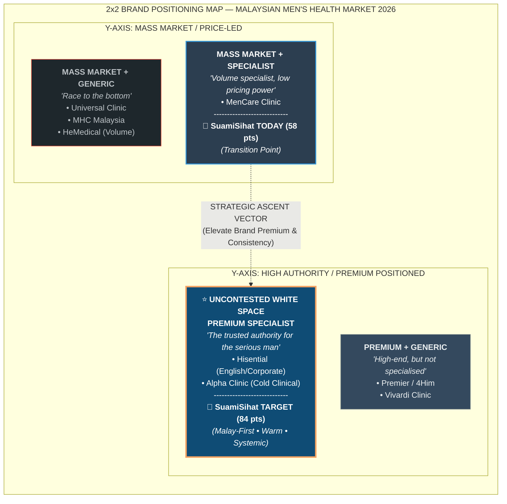
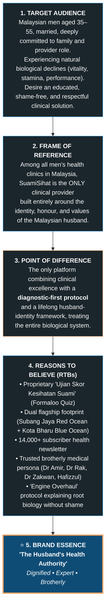
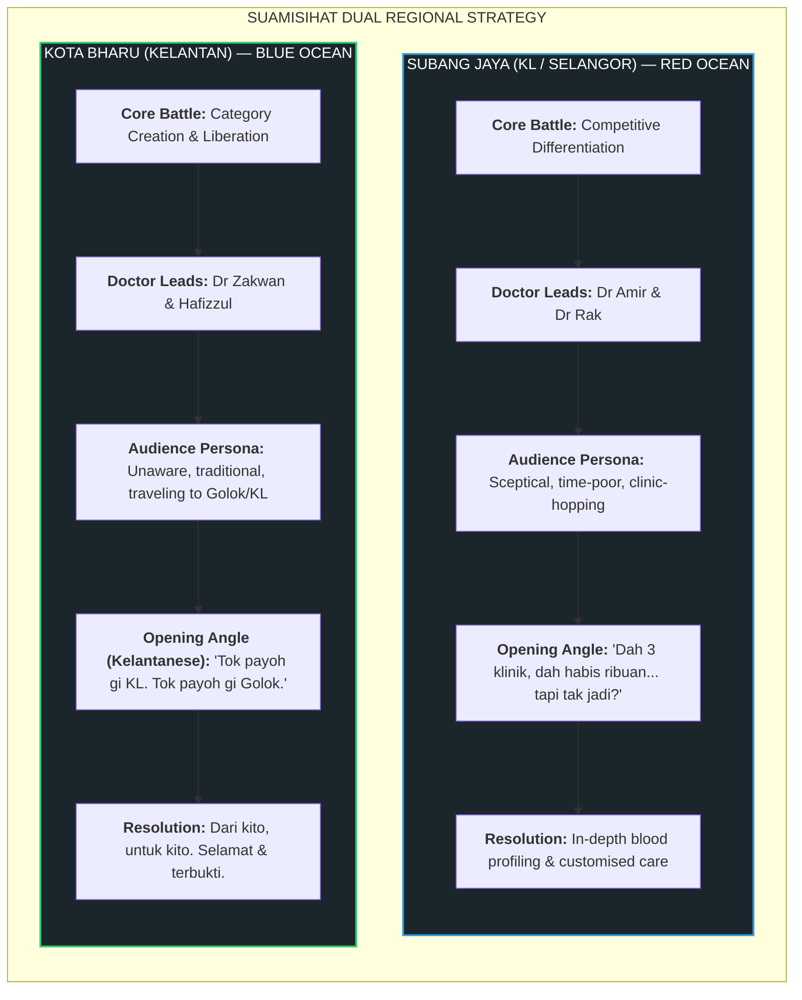
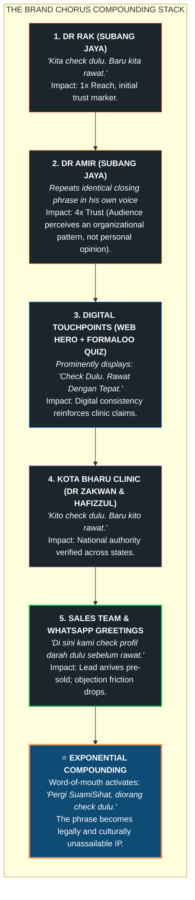

# SS Clinic Brand Positioning

**Document ID:** `SSC-STR-001`  
**Entity:** SuamiSihat Clinic Sdn. Bhd.  
**Confidentiality:** Internal Design System Reference  
**Strategic Baseline:** September 2026  
**Living Web Reference:** `https://assets.suamisihat.myds.me/doc/?doc=clinic-positioning`

---
---

## Executive Summary: The Saturation Crisis & The White Space Opportunity

The Malaysian Men's Health clinic sector is undergoing rapid, destructive commoditisation. Every competing clinic offers virtually identical clinical treatments (**Erectile Dysfunction / ED, Premature Ejaculation / PE, ESWT Shockwave Therapy, and P-Shot / Penile Fillers**), bids on identical search keywords, and deploys symptom-shaming ad copy targeting the exact same male demographic.

```
       COMMODITISED TRAP                           SUAMISIHAT STRATEGIC LEAP
 [ Race to Bottom: Price Wars ]            [ Premium Specialist: Uncontested Space ]
 [ Red & Black Fear/Shame Ads ]   =====>   [ Navy & Warm Gold Clinical Dignity     ]
 [ "Mati Pucuk" Shock Hooks   ]            [ "Jaga Enjin. Jaga Keluarga."          ]
 [ Selling Treatments First   ]            [ "Kami Tak Jual Rawatan, Cari Punca"   ]
```

### The Documented Competitor Landscape (September 2026)

| Competitor | Meta Ads Volume | Google Ads ID / Tracking | Core Copy Hook | Differentiation Level | Strategic Vulnerability |
| :--- | :--- | :--- | :--- | :--- | :--- |
| **HeMedical** | 190+ ads 🔥 | `AW-10803392252` | *"Masalah Mati Pucuk"*, *"Lemah Batin"* | **Very Low** (Volume Play) | Pure ad spend brute force; severe brand fatigue; generic red visuals. |
| **Universal Clinic** | 32 ads | `AW-10987799107` | *"Free Consultation"*, RM discounts | **Very Low** (Price War) | Margin erosion; cheapens clinical authority; low customer LTV. |
| **Men's Health Clinic MY** | 25 ads | Direct Lead Forms | *"Mati Pucuk"*, *"Pancut Awal"* | **Very Low** (Symptom Shame) | Taboo exploitation; creates patient dread rather than trust. |
| **MenCare Clinic** | 13 ads | `GTM-KPFJL9T3` | Geo-targeting multi-branch | **Medium** (Branch Network) | Convenience-led only; lacks unified medical or brand philosophy. |
| **Alpha Clinic** | 21 ads | GTM Only | *"Andrology Certified"*, *"Privacy"* | **Medium** (Clinical Authority) | Cold, clinical persona; negligible ad reach; non-engaging doctor voice. |
| **Premier Clinic (4Him)**| Heavy Aesthetic | `GTM-TS2623T` | ZSR Sunat, aesthetic-first | **Medium** (Aesthetic Crossover)| Diluted men's health focus; viewed as cosmetic/aesthetic clinic. |
| **Vivardi Clinic** | Active | `GTM-MQ394QFG` | Penile fillers + aesthetics | **Medium** (Niche Procedure) | Hyper-focused on cosmetic enhancement; misses systemic wellness. |
| **Hisential Clinic** | 4 Evergreen | `GTM-N4XRD98` | *"Executive Wellness"*, concierge | **High** (Premium Tier) | English-only; Westernized niche; entirely excludes mainstream Malay men. |
| **SuamiSihat Clinic** | **70 ads (SJ + KB)** | `AW-10963518860` | *"Engine Overhaul"*, Formaloo Quiz | **Medium** (**Needs Evolution**) | **Moat:** Proprietary diagnostic quiz. **Gap:** Red shame copy & inconsistent tone. |

> Critical Market Insight
> **6 out of 8 competitors** use identical keywords (*"mati pucuk"*, *"pancut awal"*, *"lemah batin"*) and race to the bottom on price. SuamiSihat cannot win by shouting louder in the same mud. The only defensible moat is owning an **emotional, identity-first, and diagnostic-led territory**.

---

## Competitive Positioning Scoring Matrix (9 Brands × 10 Dimensions)

Each brand is evaluated on a strict 1–10 scale across 10 strategic positioning dimensions (1 = lowest, 10 = world-class):

* **D1 — Brand Premium:** Perceived price authority; can it charge premium rates without pushback?
* **D2 — Clinical Specialisation:** Depth of specialized men's health focus (vs generic GP or aesthetic clinic).
* **D3 — Target Audience Clarity:** Precision of the ideal patient persona definition.
* **D4 — Copy Differentiation:** Originality and uniqueness of ad, web, and script copy.
* **D5 — Funnel Sophistication:** Quality of the patient lead journey (quizzes, lead nurture, educational gating).
* **D6 — Emotional Resonance:** Connection to male identity, purpose, and family vs bare biological symptoms.
* **D7 — Brand Consistency:** Cohesion of tone, visuals, and messaging across all physical and digital touchpoints.
* **D8 — Geographic Ambition:** National presence and scalability vs hyper-local clinic capture.
* **D9 — Trust Architecture:** Depth of doctor profiling, testimonials, certifications, and clinical proof.
* **D10 — Digital Ecosystem:** Website UX, interactive diagnostics, SEO authority, and retargeting maturity.

### Strategic Scoring Benchmark Table

| Brand | D1 Premium | D2 Specialist | D3 Target | D4 Copy | D5 Funnel | D6 Emotion | D7 Consist. | D8 Geo | D9 Trust | D10 Digital | Total Score / 100 | Position Rank |
| :--- | :---: | :---: | :---: | :---: | :---: | :---: | :---: | :---: | :---: | :---: | :---: | :---: |
| **Hisential** | 9 | 8 | 9 | 9 | 6 | 9 | 9 | 3 | 8 | 8 | **78** | #1 (Premium Niche) |
| **Alpha Clinic** | 7 | 9 | 8 | 6 | 5 | 6 | 7 | 3 | 8 | 6 | **65** | #2 (Clinical Niche) |
| **Premier (4Him)** | 6 | 4 | 4 | 5 | 7 | 5 | 7 | 8 | 7 | 9 | **62** | #3 (Aesthetic Hybrid) |
| **SuamiSihat TODAY** | **5** | **7** | **6** | **6** | **8** | **6** | **4** | **5** | **6** | **5** | **58** | **#4 (Evolving Contender)** |
| **MenCare** | 4 | 6 | 5 | 4 | 5 | 4 | 6 | 9 | 5 | 6 | **54** | #5 (Network Play) |
| **HeMedical** | 3 | 6 | 4 | 3 | 7 | 3 | 6 | 8 | 5 | 7 | **52** | #6 (Volume / Red Ocean) |
| **Vivardi** | 5 | 5 | 6 | 5 | 4 | 4 | 5 | 3 | 4 | 5 | **46** | #7 (Procedure Niche) |
| **Universal Clinic**| 2 | 3 | 3 | 2 | 4 | 2 | 3 | 4 | 4 | 3 | **30** | #8 (Price War Trap) |
| **MHC Malaysia** | 2 | 3 | 3 | 2 | 3 | 2 | 3 | 3 | 3 | 3 | **27** | #9 (Lowest Tier) |
| **SuamiSihat TARGET**| **8** | **9** | **9** | **9** | **9** | **9** | **8** | **7** | **8** | **8** | **84** | **Target Market Leader** |

```
                       COMPETITIVE SCORE COMPARISON (OUT OF 100)
Hisential          [██████████████████████████████████████          ] 78
Alpha Clinic       [██████████████████████████████                  ] 65
Premier (4Him)     [████████████████████████████                    ] 62
SuamiSihat (NOW)   [████████████████████████                        ] 58  <-- CURRENT BASELINE
MenCare            [█████████████████████                           ] 54
HeMedical          [████████████████████                            ] 52
Vivardi            [████████████████                                ] 46
Universal Clinic   [██████████                                      ] 30
MHC Malaysia       [████████                                        ] 27
-----------------------------------------------------------------------------------------
SuamiSihat TARGET  [██████████████████████████████████████████       ] 84  <-- STRATEGIC TARGET
```

> The SuamiSihat Competitive Moat
> SuamiSihat already holds the **highest funnel sophistication (D5: 8/10)** among all vernacular competitors thanks to the interactive Formaloo diagnostic quiz. The immediate growth levers are:
> 1. **Brand Premium (D1: 5 → 8):** Eliminate discount signalling and low-end visuals.
> 2. **Brand Consistency (D7: 4 → 8):** Standardize all doctor content, scripts, and clinic collaterals.
> 3. **Copy Differentiation (D4: 6 → 9):** Replace shame hooks with the "Honest Broker" diagnostic narrative.

---

## 2×2 Brand Positioning Map: The Uncontested White Space



### The 6 Critical Unoccupied Gaps

1. **Gap 01 — Whole-System Identity Shift:** Competitors sell single-procedure fixes (ESWT, injections). Nobody sells whole-body vitality. SuamiSihat owns the *"Engine Overhaul"* systemic approach connecting vascular, hormonal, metabolic, and psychological health.
2. **Gap 02 — Malay Premium Authority:** Hisential serves English-speaking executives; Alpha is clinically sterile. Nobody owns premium, dignified, educated men's health for Malay men. SuamiSihat's dual presence (**Subang Jaya + Kota Bharu**) anchors a unique national Malay footprint.
3. **Gap 03 — Husband & Family Framing:** Competitors treat patients as isolated men with embarrassing dysfunctions. SuamiSihat anchors the journey around his role as a **husband, father, and provider** (*"Untuk isteri, keluarga, dan maruah suami"*).
4. **Gap 04 — Diagnostic-First Brand Infrastructure:** Competitors push patients immediately to WhatsApp sales chat. SuamiSihat guides leads through a clinical diagnostic assessment (**Formaloo Quiz**) before recommending any treatment.
5. **Gap 05 — Long-Term Health Lifecycle Partner:** Other clinics transact single appointments. SuamiSihat leverages its **14,000+ subscriber newsletter**, ongoing diagnostic check-ins, and multi-stage care to accompany men from their late 30s through their 50s and beyond.
6. **Gap 06 — Destigmatisation Without Trivialisation:** Competitors alternate between vulgar red shock ads (*"Mati Pucuk!"*) and cold medical jargon. SuamiSihat adopts a dignified, empathetic, brotherly tone (analogous to *BetterHelp* for mental health).

---

## Formal Brand Positioning Statement Ladder



---

## Tagline Architecture & The "No-BS" Positioning System

### Tagline vs Slogan: The Operating Principle

| Dimension | Permanent Brand Tagline | Fluid Campaign Slogans |
| :--- | :--- | :--- |
| **Core Function** | Defines permanent corporate & brand identity (*Who we are*). | Tactical battle cries for markets, seasons, and campaigns (*What we say today*). |
| **Primary Placement**| Logo lockups, clinic signage, letterheads, website footer, brand guidelines. | Video openings/closings, ad headlines, WhatsApp intros, landing pages. |
| **Change Frequency** | Permanent (never changes unless formal corporate rebrand). | Fluid, campaign-driven, and regionally tailored. |
| **Canonical Copy** | **"Men's Health Engineered For You"** | **SJ:** *"Kita Check Dulu. Baru Kita Rawat."*<br/>**KB:** *"Tok Payoh Gi KL. Tok Payoh Gi Golok."* |

---

### The 4-Level Tagline Architecture


---

### The Final "No-BS" Positioning Copy Suite

The clinic's deepest, most defensible competitive moat is **radical diagnostic honesty**:

```
"Ramai yang dah habis ribuan ringgit dekat klinik lain... rawatan dah buat, tapi tak jadi.
Kenapa? Sebab klinik tu jual rawatan dulu. Mereka tak tahu apa sebenarnya yang tak kena dengan badan client tu."
```

#### Standardized Verbal & Copy Assets

* **Primary Tagline (All Touchpoints):**
  > **"Kami Tak Jual Rawatan. Kami Cari Punca."**
  > *(We don't sell treatments. We find the root cause.)*

* **The 3-Point Brand Promise Stamp:**
  > **"Check Dulu. Rawat Dengan Tepat. Tiada Janji Palsu."**
  > *(Use on website hero banners, pinned posts, WhatsApp bios, and clinic signage)*

* **Mandatory Verbal Video Hook (Doctors' Video Close):**
  > **"Kita check dulu. Baru kita rawat."**
  > *(Mandatory in the final 3 seconds of EVERY doctor video, Reel, and TikTok)*

* **Empathy Ad Opener:**
  > **"Dah habis ribuan, tapi masih tak jadi?"**
  > *(Validates patient frustration without shame; positions clinic as the honest antidote)*

* **Medium Differentiation Statement (Web Sub-headings & WhatsApp Inquiries):**
  > **"Di sini, kita padankan rawatan dengan badan anda, kehendak anda, dan bajet anda."**

#### Landing Page & Static Ad Core Copy Block

> **Klinik lain jual rawatan. Kami jual kejujuran.**  
>  
> Sebelum apa-apa, kami semak profil darah & kesihatan anda dulu, padankan dengan kehendak anda dan bajet anda, baru kami cadangkan rawatan yang betul-betul sesuai untuk anda.  
>  
> Tak ada janji palsu. Tak ada rawatan yang tak perlu.  
> Hanya penyelesaian yang tepat, untuk badan anda.  
>  
> **[ MULAKAN PEMERIKSAAN ANDA HARI INI ]**

---

### The Touchpoint Deployment Map

| Touchpoint Channel | Exact Copy Asset Assigned | Target Placement | Execution Frequency |
| :--- | :--- | :--- | :--- |
| **Doctor Live Sessions** | Verbal Hook | Opening 15s + Final 5s close | 100% of Live sessions |
| **Reels & TikToks** | Empathy Hook + Verbal Hook | Opening frame + Final 3s: *"Kita check dulu. Baru kita rawat."* | Every video by every doctor |
| **Static Meta / Google Ads** | Primary Tagline + Medium Block | Headline: *"Kami Tak Jual Rawatan, Cari Punca"* | All creative iterations |
| **Website Hero Section** | 3-Point Brand Promise Stamp | Immediately beneath primary H1 heading | Permanent hero feature |
| **Sales Landing Pages** | Medium Version Copy Block | Directly below hero fold with bold typography | Every service landing page |
| **WhatsApp First Reply** | Differentiation Statement | Second sentence of automated welcoming flow | Every incoming conversation |
| **Formaloo Quiz Entry** | Brand Promise Stamp | Screen 1: *"Ini bukan borang biasa. Ini pemeriksaan awal anda."* | Permanent quiz gateway |
| **In-Clinic Signage** | Primary Tagline | Large-format waiting lounge acrylic wall graphic | Subang Jaya & Kota Bharu |
| **Email Newsletters** | Empathy Story + Trigger Closer | Narrative arc closing with *"Suami Sihat, Keluarga Bahagia."* | Bi-weekly broadcast anchor |
| **Doctor Social Bios** | Brand Promise Stamp | Profile bio: *"Check Dulu. Rawat Dengan Tepat. \| @suamisihat"* | Dr Amir, Dr Rak, Dr Zakwan |

---

## Brand Voice & Visual Identity System

### Brand Voice Rules

```
                      BRAND VOICE BOUNDARY MATRIX
     WHAT SUAMISIHAT IS                  WHAT SUAMISIHAT IS NOT
 [ Warm, brotherly, respected peer ] <-> [ Cold, clinical, preachy doctor ]
 [ Conversational, educated Malay  ] <-> [ Rigid formal BM or coarse street slang ]
 [ "Sinyal semulajadi badan..."    ] <-> [ "MATI PUCUK?! RAWAT SEGERA!" ]
 [ Systemic optimisation & health  ] <-> [ Deficit fixing & performance panic ]
 [ "Seorang suami bertanggungjawab"] <-> [ "A patient with sexual dysfunction" ]
 [ "Mulakan Pemeriksaan Anda"      ] <-> [ "Cepat book! Tinggal 2 slot!" ]
```

### Visual Palette Shift: Rejecting "The Homogenised Red"

All low-tier competitors (HeMedical, Universal, MHC, MenCare) rely on aggressive red-and-black banners, bold yellow exclamation marks, and anxiety-inducing before/after insinuations.

To project medical authority and familial respect, SuamiSihat transitions to a high-trust clinical executive palette:

```
┌─────────────────────────┬─────────────────────────┬─────────────────────────┐
│        DEEP NAVY        │        WARM GOLD        │       CLEAN WHITE       │
│         #0F4C75         │         #F4A261         │         #FFFFFF         │
│                         │                         │                         │
│   Clinical Authority,   │    Warmth, Vitality,    │    Sterile Hygiene,     │
│   Trust, Discretion     │    Family Respect       │    Clarity, Space       │
└─────────────────────────┴─────────────────────────┴─────────────────────────┘
```

* **Navy Blue (`#0F4C75`):** Serves as 60% dominant background on web heroes, waiting lounge walls, and video backdrops.
* **Clean White (`#FFFFFF`):** Serves as 30% canvas, typography, and card containers ensuring clinical clarity.
* **Warm Gold (`#F4A261`):** Serves as 10% high-intent focal accents (primary CTAs, diagnostic badges, checkmarks).
* **Strict Blacklist:** Eliminate bright red banners, flash-sale discount tags, and stock photos of distressed men clutching their foreheads.

---

## Doctor Content Playbooks: Two Markets, Two Playbooks

SuamiSihat operates in two structurally distinct market environments. The national brand message remains identical, but the strategic angle reflects local market maturity.



### Strategic Comparison Matrix: Subang Jaya vs Kota Bharu

| Operational Dimension | Subang Jaya Clinic (Dr Rak & Dr Amir) | Kota Bharu Clinic (Dr Zakwan & Hafizzul) |
| :--- | :--- | :--- |
| **Market Nature** | **Red Ocean:** Saturated with 8 competitors. | **Blue Ocean:** Modern category barely exists locally. |
| **Primary Objective** | Contrast SuamiSihat against bad competitor experiences. | Create the category; establish first-mover brand authority. |
| **Emotional Trigger** | Relief from previous clinical failure and wasted money. | Local pride, relief, safety, dignity, and geographical proximity. |
| **Dialect & Tone** | Conversational, modern, educated urban Malay. | **Authentic Kelantanese dialect** (*Kecek Kelate*). |
| **Opening Hook** | *"Dah habis ribuan dekat klinik lain, tapi tak jadi?"* | *"Tok payoh gi KL doh. Tok payoh gi Golok."* |
| **Closing Tagline** | *"Kita check dulu. Baru kita rawat."* | *"Kito check dulu. Baru kito rawat. Dari Kelate, untuk Kelate."* |
| **Pinned Comment** | *"Suami Sihat, Keluarga Bahagia."* | *"Suami Sihat, Keluarga Bahagia. Dari Kelate, untuk Kelate."* |

---

### Playbook A: Subang Jaya Script & Content Formula

#### The 5-Step Weekly Story Structure
1. **Hook:** *"Dah 3 klinik, dah habis ribuan ringgit... masih tak jadi."*
2. **The Mistake:** Explain that other clinics push expensive treatments immediately to hit sales targets.
3. **The Discovery:** Share what SuamiSihat's comprehensive health & hormone profile actually revealed (e.g. vascular flow, endocrine balance).
4. **The Match:** Detail how treatment was tailored precisely to his biology, expectations (*kehendak*), and budget.
5. **The Result & Close:** Dignified, honest outcome without wild exaggerations → *"Kita check dulu. Baru kita rawat."*

#### Subang Jaya Full Video Opening Script (First 15 Seconds)
```
"Ramai client yang datang ke sini... dah habis ribuan ringgit dekat klinik men's health lain.
Ramai dari Klinik 'H' ada, dari Klinik 'A', Klinik 'M' pun ada.
Rawatan mereka dah buat macam-macam. Tapi tak jadi-jadi — kesan short term je.

Tahu kenapa? Sebab klinik-klinik tu tak check apa yang sebenarnya tak kena dengan badan client.
Mereka terus jual rawatan — nak kejar komisyen.

Di SuamiSihat, kita check dulu profil badan & hormon anda secara in-depth.
Ramai doktor kat luar sana taknak syorkan client invest betul-betul pada health profiling.
Padahal, itu yang penting!

Lepas dah tahu semua bacaan, kita duduk, analyze sama-sama — baru kita suggest rawatan yang sesuai.
Customized. Personalized."
```

---

### Playbook B: Kota Bharu Script & Content Formula (Kelantanese Dialect)

> Why the Dialect is an Unfair Competitive Advantage
> Any national clinic chain can run social media ads in Kelantan. But only a local Kelantanese doctor authentically saying *"Tok payoh gi Golok doh"* can connect with decades of lived experience (clandestine trips across the border, unsafe black-market medication, high travel expenses, and personal shame). No KL-based competitor can duplicate this cultural bond.

#### Kota Bharu Full Video Opening Script (First 15 Seconds)
```
"Ramai lelaki di Kelantan tok tahu... ada klinik khusus untuk kesihatan lelaki kat Kota Bharu ni.
Selama ni kene gi KL jauh-jauh, atau yang bahayo tu — gi Golok, gi Thailand.
Rawatan yang entah selamat entah tok. Entah doktor betul ke tak.
Balik pun tok tentu okay, kesan pun short term je.

Sekarang, tok payoh doh.
Suami di Kelantan tok perlu pergi KL doh.
Kat sini, di SuamiSihat Kota Bharu — dapat harga terbaik. Pantas sek kito.
Selamat, mantap, dan lebih jimat dari gi jauh-jauh.

Tok payoh pergi Golok. Tok payoh pergi Thailand.
Untuk rawatan zakar, untuk kesihatan lelaki — SuamiSihat doh ado kat Kelate.

Kito check profil badan anda dulu, kito analyze sama-sama, baru kito suggest rawatan yang betul-betul sesuai.
Customized. Personalized. Selamat.
Dari kito, untuk kito. Dari lelaki Kelate, untuk lelaki Kelate."
```

#### Dialect Glossary
* *Tok payoh* = Tak perlu  
* *Kito* = Kita  
* *Doh ado* = Dah ada  
* *Tok tentu* = Tidak pasti  
* *Hok* = Yang  
* *Nok* = Hendak / Mahu  
* *Pulok* = Pula  
* *Bahayo* = Bahaya  

---

### Strictly Forbidden Guidelines for All Doctors

| Rule Category | Strictly Prohibited Behavior | Approved SuamiSihat Standard |
| :--- | :--- | :--- |
| **Shock Openers** | Opening with *"Mati pucuk?"* or graphic anatomy slides. | Open with educational empathy or biological signals. |
| **Speed Claims** | Promising miracles (*"Keras dalam 1 sesi!"*). | Emphasize thorough diagnostics and sustainable biological recovery. |
| **Shame Language**| Asking *"Masih tak kuat lagi ke?"* | Reframe as natural age signals: *"Ini peringatan semulajadi badan."* |
| **Terminology** | Using the term *"fitrah"* in ad copy. | Always use **"semulajadi"**. |
| **Punctuation** | Using em-dashes (`—`) in written copy. | Use commas, colons, or clean line breaks. |
| **Regional Mismatch**| Using KL slang in Kota Bharu or vice-versa. | Respect authentic regional voice while preserving brand spine. |

---

## The Brand Chorus: Repetition as an Unfair Advantage



### Cognitive Psychology: The Illusory Truth Effect

The human brain relies on pattern recognition to determine trustworthiness. When a prospect hears an identical core truth articulated independently by separate professionals across diverse channels, the subconscious ceases evaluating it as advertising and categorizes it as established medical fact.

| Impression Stage | Touchpoint Source | Prospect Internal Thought | Subconscious Trust Score |
| :---: | :--- | :--- | :---: |
| **1st Exposure** | Dr Rak's TikTok video | *"Interesting. This doctor emphasizes checking before treating."* | Low (Single data point) |
| **2nd Exposure** | Dr Amir's Instagram Reel | *"Wait, this other doctor says the exact same thing..."* | Low-Medium (Coincidence?) |
| **3rd Exposure** | SuamiSihat Website Hero | *"It's on their website banner too. This is their standard practice."*| Medium (Pattern recognized) |
| **4th Exposure** | WhatsApp Auto-Reply | *"Even their clinic coordinators say it. This is genuine."* | Medium-High (Trust established)|
| **5th Exposure** | Dr Zakwan's Kelantan Live | *"Even their doctor in the East Coast does this. It's a national system."*| High (Systemic belief) |
| **6th+ Exposure** | Word-of-Mouth from Peer | *"Go to SuamiSihat, diorang check dulu baru rawat."* | **Absolute Conviction** |

### The Real-World Sales Transformation

```
                     WITHOUT BRAND CHORUS                   WITH FULL BRAND CHORUS
[ New Lead Inquiry ] -> Sales spends 12 mins explaining      -> Lead says: "I saw Dr Rak, I know you check first."
                        who SuamiSihat is.                      Booking confirmed in under 3 minutes.

[ Price Objection  ] -> Lead: "Klinik lain murah lagi."      -> Response: "Kami check cari punca dulu, sebab tu
                        Sales scrambles and discounts.          rawatan kami jadi." Lead agrees immediately.

[ Cancelled Consult] -> Ghosted forever.                     -> Follow-up: "Tak apa, bila tuan sedia, kita check
                                                                dulu baru rawat." Brand seed stays planted.
```

### The 4 Unbreakable Brand Chorus Rules

1. **Same Message, Different Voices:** Every physician, coordinator, and copywriter speaks the same spine (*"Check dulu, rawat dengan tepat"*), but infuses their individual personality.
2. **Never Break the Chorus:** If a single team member reverts to cheap shame hooks or promises instant 24-hour cures, the entire pattern fractures. Discipline beats cleverness.
3. **90 Days Minimum Commitment:** The Chorus is compounding interest. Do not abandon phrases after two weeks because they feel repetitive internally. The audience only begins noticing after the fifth repetition.
4. **Track When Competitors Copy:** When rival clinics begin adopting *"check dulu"* language in their ads, celebrate it as validation that SuamiSihat has established mental market leadership.

---

## 18-Month Brand Evolution Roadmap

```mermaid
flowchart LR
    subgraph ROADMAP ["18-MONTH BRAND ASCENT ROADMAP"]
        direction TB

        subgraph P1 ["PHASE 1: FOUNDATION & SIGNAL PLANTING (M1–M4)"]
            direction TB
            P1_1["• Lock tagline: 'Jaga Enjin. Jaga Keluarga.'"]
            P1_2["• Visual makeover: Navy (#0f4c75) + Warm Gold (#f4a261)"]
            P1_3["• Audit & purge 100% of shame ad copy"]
            P1_4["• Rebrand quiz as 'Ujian Skor Kesihatan Suami'"]
            P1_5["• Standardise 2-page voice guide for all doctors"]
            P1_1 --> P1_2 --> P1_3 --> P1_4 --> P1_5
        end

        subgraph P2 ["PHASE 2: AUTHORITY BUILDING (M5–M10)"]
            direction TB
            P2_1["• Weekly men's health editorial newsletter"]
            P2_2["• Authentic husband + wife clinical testimonials"]
            P2_3["• Deep-dive biology educational video library"]
            P2_4["• Doctor PR placement in mainstream media"]
            P2_5["• Introduce named clinical packages (e.g. Servis Asas)"]
            P2_1 --> P2_2 --> P2_3 --> P2_4 --> P2_5
        end

        subgraph P3 ["PHASE 3: MARKET OWNERSHIP (M11–M18)"]
            direction TB
            P3_1["• SuamiSihat Clinic nationwide franchise expansion"]
            P3_2["• Launch SuamiSihat Academy for coaching IP"]
            P3_3["• Proprietary 'Husband Health Score' enterprise product"]
            P3_4["• Corporate B2B 'Men's Health at Work' programs"]
            P3_5["• 'Engine Fuel' nutraceutical supplement rollout"]
            P3_1 --> P3_2 --> P3_3 --> P3_4 --> P3_5
        end
    end

    P1 ==> P2 ==> P3

    style P1 fill:#1b262c,stroke:#3498db,stroke-width:2px,color:#ffffff
    style P2 fill:#1b262c,stroke:#f39c12,stroke-width:2px,color:#ffffff
    style P3 fill:#0f4c75,stroke:#2ecc71,stroke-width:3px,color:#ffffff
```



### Phase Transition Milestone Gates

| Benchmark Metric | Phase 1 Complete When... | Phase 2 Complete When... | Phase 3 Complete When... |
| :--- | :--- | :--- | :--- |
| **Brand Recognition** | New leads recite *"check dulu"* without prompting. | Patients request doctors by name and refer friends. | SuamiSihat ranks Top 3 organic search in Malaysia. |
| **Pricing Authority** | Zero price resistance inside the diagnostic quiz. | Average consult order value increases by +20%. | Active waiting lists for high-tier overhaul packages. |
| **Ad Efficiency** | Cost-per-lead (CPL) drops 15% with new angle. | Organic & referral leads represent 25% of volume. | Word-of-mouth becomes #1 patient acquisition source. |
| **Media Stature** | 100% unified visual identity across web and clinic. | First mainstream press feature as medical authority. | Regular TV/radio/podcast guest appearances. |

---

## First 90 Days Execution Checklist

```markdown
- [ ] **Action 01: Lock Primary Tagline (Day 1–14)**
  - Brief design and creative teams on *"Jaga Enjin. Jaga Keluarga."*
  - Update all Meta ad copies, Google Ad headlines, and web hero text.

- [ ] **Action 02: Deploy Clinical Visual Identity (Day 7–21)**
  - Transition assets to Navy Blue (`#0F4C75`), Warm Gold (`#F4A261`), and White (`#FFFFFF`).
  - Redesign ad templates, landing page headers, and clinic consultation backdrops.

- [ ] **Action 03: Rebrand Diagnostic Gateway (Day 14–30)**
  - Rename Formaloo Quiz to *"Ujian Skor Kesihatan Suami"*.
  - Build automated scorecard outcome page showing personalized score out of 100.

- [ ] **Action 04: Implement Trigger Line Routine (Day 14–30)**
  - Mandate *"Suami Sihat, Keluarga Bahagia."* as standard sign-off across all emails, WhatsApp replies, invoices, and post comments.

- [ ] **Action 05: Complete Shame Copy Purge (Day 1–14)**
  - Review all 70 active ads; delete *"mati pucuk"*, *"lemah batin"*, and high-pressure discount countdowns.

- [ ] **Action 06: Distribute 2-Page Doctor Voice Guide (Day 14–28)**
  - Distribute physical and digital desk briefs to Dr Amir, Dr Rak, Dr Zakwan, Hafizzul, and clinical teams.

- [ ] **Action 07: Launch 'Engine Service' Creative Series (Day 30–60)**
  - Release analogy ads: *"Kereta anda servis setiap tahun. Bila akhir kali badan anda di-servis?"*
  - Run side-by-side split testing against legacy creatives; benchmark CPL improvement.

- [ ] **Action 08: Institutionalise Competitor Intelligence (Day 30–90)**
  - Establish monthly Meta Ads Library audit tracking when rival clinics attempt to imitate SuamiSihat's diagnostic narrative.
```

---

## Related Notes & Vault Architecture

* 02-SSC — SuamiSihat Clinic — Clinic operations and clinical service protocols
* SSC-GUI-001 — Clinic Homepage Designer Guide — Website UX architecture and layout rules
* SSC-TSK-001 — Campaign Panjang & Besar Male Visibility — Targeted campaign execution
* 00-Group-Shared/Product-and-Branding — Design system, tokens, and corporate palettes
* 05-SSE — SuamiSihat E-Commerce — DMR Universe, direct response copywriting, and video ads


---

## Vault Cross-References & Synchronization

- **Vault Master Note:** `SSC-STR-001 — SuamiSihat Clinic Brand Positioning & Branding Strategy.md` *(mirrored in `d:\OneDrive\Völundr`)*
- **Ecosystem Hub:** 00-Directory — SuamiSihat Ecosystem Hub (Section 2: 02-SSC)
- **Clinic Homepage Layout Standard:** SSC-GUI-001 — Clinic Homepage Designer Guide
- **Living Web Documentation:** `https://assets.suamisihat.myds.me/doc/?doc=clinic-positioning`
- **Sub-Brand Hub:** [SS Clinic](doc.html?doc=sub-brands/ss-clinic)
- **Related Docs:** [Brand Voice](doc.html?doc=brand-voice) — [Vision & Mission](doc.html?doc=vision-mission) — [Colour Composition](doc.html?doc=color-composition-guide)
