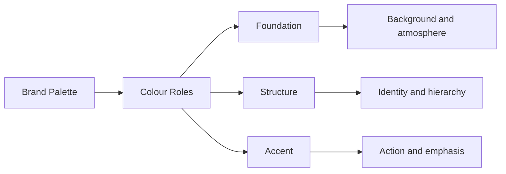
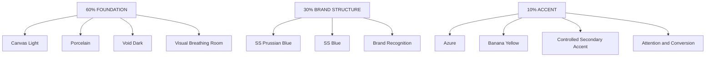
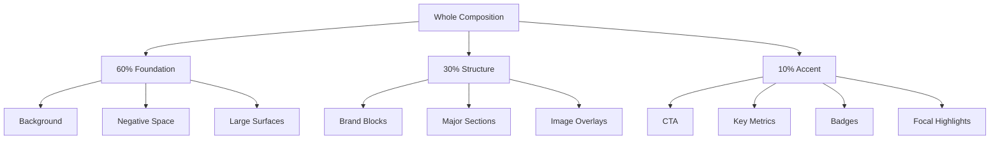
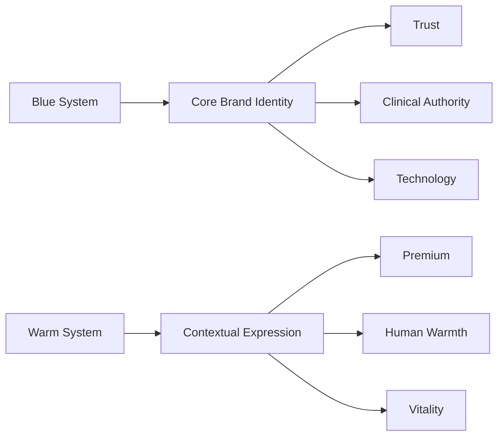
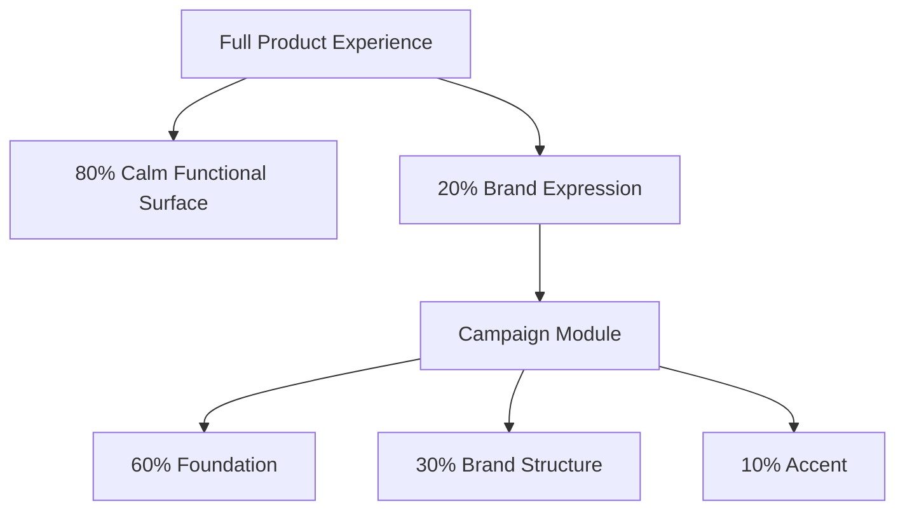
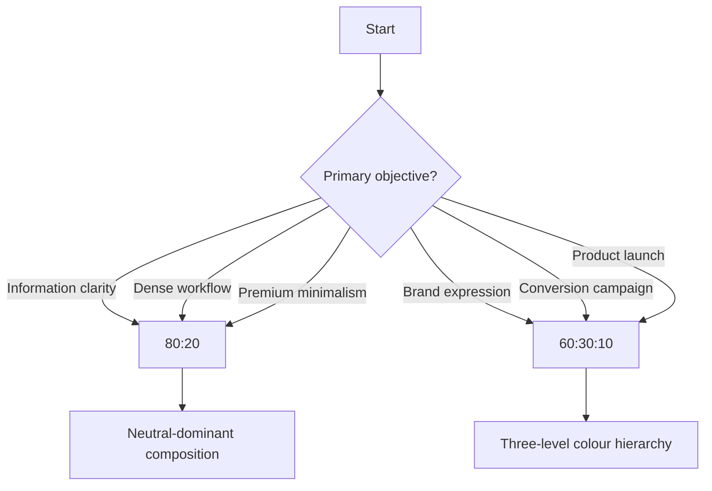

# Colour Distribution in the SuamiSihat Brand System

> **Conclusion:** For SuamiSihat, the **60:30:10 rule should be the primary colour-composition framework**. The 80:20 model is useful as a secondary simplification for UI-heavy or minimal executions, but 60:30:10 provides better hierarchy for a brand that needs to balance authority, readability, warmth, and campaign emphasis.

---

> **Decision**
>
> SuamiSihat should adopt **60:30:10 as the primary colour-composition rule** for brand communication, campaigns, marketing, packaging, editorial layouts and expressive landing pages.
>
> **80:20 should remain a secondary composition model** for product UI, dense interfaces and deliberately minimal executions.
>
> The reason is structural: SuamiSihat already has a colour architecture that maps naturally to **60% foundation, 30% brand structure and 10% accent/conversion**. 

---

## 1. The Problem Colour Rules Actually Solve

A colour palette answers:

> **What colours belong to the brand?**

A colour-composition rule answers:

> **How much visual territory should each colour occupy?**

These are not the same problem.

A palette without a composition rule creates predictable failure modes:

- every brand colour competes for attention
- designers overuse accent colours
- CTAs lose urgency
- layouts become visually noisy
- campaigns drift away from the master identity
- different designers interpret the palette differently
- premium colours become decoration instead of hierarchy

### The governing principle

Colour is not only decoration.

It is a **resource allocation system for visual attention**.

The larger the colour area, the more structural responsibility it carries.

The smaller the colour area, the more precisely it should direct attention.



---

# 2. What Is the 60:30:10 Colour Rule?

The **60:30:10 rule** divides a composition into three levels of colour dominance:

| Ratio | Role | Job |
|---|---:|---|
| **60%** | Dominant | Creates the visual environment |
| **30%** | Secondary | Establishes structure and brand presence |
| **10%** | Accent | Directs attention and creates emphasis |

The percentages are **composition targets**, not literal pixel measurements.

A design does not fail because one colour occupies 61%.

The rule exists to preserve **visual hierarchy**.

## Basic model

```text
┌─────────────────────────────────────────────┐
│                                             │
│                 60%                         │
│                                             │
│           DOMINANT FOUNDATION               │
│                                             │
├───────────────────────────────┐             │
│                               │             │
│            30%                │    10%      │
│                               │   ACCENT    │
│        SECONDARY              │   ACTION    │
│        STRUCTURE              │   EMPHASIS  │
│                               │             │
└───────────────────────────────┴─────────────┘
```

The visual hierarchy should read:

```text
ENVIRONMENT
    ↓
BRAND STRUCTURE
    ↓
FOCAL ACTION
```

---

# 3. The SuamiSihat Translation

SuamiSihat's current design system already contains a remarkably direct implementation of this logic.

The brand system explicitly identifies:

- **Canvas Light / Void Dark — 60%**
- **SS Prussian Blue — 30% secondary and foundation structure**
- **Azure — 10% accent**
- Banana Yellow as a high-visibility CTA and conversion colour. 

That means the recommended rule is not an arbitrary imported design theory.

It is already embedded in the brand's colour semantics.

## Recommended hierarchy

| Distribution | SuamiSihat role | Primary candidates | Typical use |
|---|---|---|---|
| **60%** | Foundation | Canvas Light `#F8FAFC`, Void Dark `#090D16`, Porcelain `#FCFAF6` | Backgrounds, large fields, negative space |
| **30%** | Brand structure | SS Prussian Blue `#022057`, SS Blue `#043388` | Sections, major blocks, identity fields |
| **10%** | Accent | Azure `#21A1F7`, Banana `#FCE53D` | CTA, conversion, highlights, focal moments |

### Important distinction

**The ratio applies to roles, not necessarily one literal HEX value.**

For example:

```text
60% FOUNDATION
├── Canvas Light
├── Porcelain
└── Void Dark

30% BRAND STRUCTURE
├── Prussian Blue
└── SS Blue

10% ACCENT
├── Azure
├── Banana
└── Controlled supporting accents
```

This allows the system to remain flexible without losing hierarchy.

---

# 4. SuamiSihat 60:30:10 Architecture



The composition therefore becomes:

> **Neutral environment → blue brand authority → high-energy interaction.**

This aligns with the current brand positioning of **clinical precision, masculine dignity, energy and premium restraint**. 

---

# 5. What Is the 80:20 Colour Rule?

The **80:20 rule** is a simplified two-level composition model.

| Ratio | Role |
|---:|---|
| **80%** | Foundation |
| **20%** | Brand and interaction |

Instead of maintaining three visible levels of colour, it compresses the system into:

```text
BACKGROUND / STRUCTURE
        ↓
BRAND SIGNAL
```

## Basic model

```text
┌──────────────────────────────────────────────┐
│                                              │
│                                              │
│                                              │
│                    80%                       │
│                                              │
│              FOUNDATION / SPACE              │
│                                              │
│                                              │
├──────────────────────────────────────────────┤
│                    20%                       │
│            BRAND / ACTION / EMPHASIS         │
└──────────────────────────────────────────────┘
```

The 80:20 model intentionally reduces visual complexity.

Its strength is restraint.

Its weakness is that it provides **less hierarchy inside the coloured portion**.

---

# 6. How 80:20 Works for SuamiSihat

A SuamiSihat implementation could be:

| Distribution | Colour role | Example |
|---:|---|---|
| **80%** | Neutral foundation | Canvas Light / Porcelain / Void Dark |
| **20%** | Brand signal | SS Blue / Prussian Blue / Azure |

Example:

```text
80%
████████████████████████████████████████
Neutral surface / content space

20%
██████████
Blue identity / interactive elements
```

This is particularly effective when:

- information density is high
- the product must feel calm
- readability matters more than campaign energy
- the interface already has strong structural hierarchy
- the visual system follows Fluent 2 surface behaviour
- colour must not compete with content

This matters because SuamiSihat's component architecture explicitly uses a semantic token model and Fluent-style surfaces rather than raw colours directly inside components. 

---

# 7. 60:30:10 vs 80:20

## Strategic comparison

| Dimension | 60:30:10 | 80:20 |
|---|---|---|
| Colour hierarchy | **Three levels** | Two levels |
| Visual energy | Higher | Lower |
| Brand expression | Strong | Restrained |
| Campaign suitability | Excellent | Moderate |
| Product UI suitability | Good | **Excellent** |
| CTA visibility | **Very strong** | Depends on implementation |
| Editorial layouts | **Excellent** | Good |
| Dense information | Moderate | **Excellent** |
| Premium/minimal feel | Good | **Excellent** |
| Risk of visual noise | Medium if misused | Low |
| Design flexibility | **High** | Moderate |
| Best use | Brand communication | Functional interfaces |

---

## Decision chart

| Context | Recommended rule |
|---|---|
| Marketing campaign | **60:30:10** |
| Landing page | **60:30:10** |
| Product launch | **60:30:10** |
| Social campaign | **60:30:10** |
| Packaging | **60:30:10** |
| Brand presentation | **60:30:10** |
| Editorial content | **60:30:10** |
| Health dashboard | **80:20** |
| EHR / clinical system | **80:20** |
| Dense SaaS interface | **80:20** |
| Settings / forms | **80:20** |
| Data-heavy screen | **80:20** |
| Minimal premium page | **80:20** |

---

# 8. Comparison Diagram

```mermaid
quadrantChart
    title Choosing Between 60:30:10 and 80:20
    x-axis Low Brand Expression --> High Brand Expression
    y-axis High Information Density --> Low Information Density
    quadrant-1 60:30:10 Territory
    quadrant-2 Hybrid Territory
    quadrant-3 80:20 Territory
    quadrant-4 Campaign Territory
    Dashboard: [0.25, 0.20]
    Clinical System: [0.20, 0.15]
    Settings Page: [0.20, 0.30]
    Landing Page: [0.75, 0.65]
    Marketing Campaign: [0.90, 0.90]
    Product Launch: [0.85, 0.75]
    Editorial Article: [0.65, 0.70]
```

---

# 9. The Critical Difference: Hierarchy vs Simplicity

The two systems solve different design problems.

## 60:30:10

The question is:

> **How do we create a hierarchy of environment, identity and attention?**

The answer is:

```text
60% = Where am I?
30% = Whose world am I in?
10% = What should I notice or do?
```

## 80:20

The question is:

> **How do we remove unnecessary visual competition?**

The answer is:

```text
80% = Stay out of the user's way.
20% = Show only what matters.
```

This is why 80:20 works exceptionally well for interfaces.

The interface itself already has hierarchy through:

- typography
- spacing
- grouping
- elevation
- component states
- information architecture

It does not need colour to do all the work.

---

# 10. Recommended SuamiSihat Model

## Primary Rule: 60:30:10

Use for **brand-facing and expressive communication**.

```text
┌───────────────────────────────────────────┐
│                                           │
│                  60%                      │
│                                           │
│         CANVAS / ATMOSPHERE               │
│     #F8FAFC / #FCFAF6 / #090D16           │
│                                           │
├───────────────────────────────┬───────────┤
│                               │           │
│             30%               │    10%    │
│                               │           │
│        BRAND AUTHORITY        │  ACTION   │
│                               │  ENERGY   │
│   #022057 / #043388           │ #21A1F7  │
│                               │ #FCE53D  │
└───────────────────────────────┴───────────┘
```

### Recommended use

- campaigns
- advertisements
- hero sections
- launch pages
- product marketing
- packaging
- social media
- presentations
- branded editorial
- video keyframes

---

## Secondary Rule: 80:20

Use for **functional and information-heavy experiences**.

```text
┌───────────────────────────────────────────┐
│                                           │
│                                           │
│                                           │
│                    80%                    │
│                                           │
│          NEUTRAL / CONTENT SPACE          │
│                                           │
│                                           │
├───────────────────────────────────────────┤
│                    20%                    │
│                                           │
│             BRAND + INTERACTION           │
│                                           │
└───────────────────────────────────────────┘
```

### Recommended use

- dashboards
- patient systems
- account areas
- onboarding flows
- forms
- settings
- admin interfaces
- EHR-adjacent products
- dense mobile screens

---

# 11. Recommended Colour Roles

The current palette should not be treated as eight colours with equal rights.

That is the fastest route to visual inconsistency.

Instead, assign colours to **jobs**.

| Colour | Role | Recommended usage |
|---|---|---|
| **Canvas Light** `#F8FAFC` | Primary foundation | Light-mode layouts and large background areas |
| **Void Dark** `#090D16` | Dark foundation | Dark-mode layouts, premium campaigns |
| **Porcelain** `#FCFAF6` | Soft foundation | Warm premium backgrounds |
| **SS Prussian Blue** `#022057` | Authority | Major brand fields and structural depth |
| **SS Blue** `#043388` | Core identity | Corporate identity and primary brand blocks |
| **Azure** `#21A1F7` | Interactive accent | Buttons, links, focus and controlled emphasis |
| **Banana** `#FCE53D` | Conversion accent | High-visibility CTA and campaign emphasis |
| **Malibu** `#6DC6EC` | Atmospheric accent | Tints, washes, glow and secondary interaction |
| **Lion** `#BD9A73` | Premium accent | Seals, borders and premium communication |
| **Fawn** `#CCAC8D` | Warm support | Secondary surfaces and badges |
| **Arylide** `#E5D15C` | Vitality highlight | Ratings and limited highlights |

These roles are consistent with the current system definitions, which distinguish foundation surfaces, core blues, interactive Azure, high-visibility Banana, and supporting warm accents. 

---

# 12. Do Not Treat Accent Colours as Equal

This is the most important implementation rule.

SuamiSihat has multiple accent colours.

That does **not** mean all accents should appear simultaneously.

## Incorrect

```text
Azure + Banana + Arylide + Lion + Fawn
        ↓
Every colour asks for attention
        ↓
Nothing is important
```

## Correct

```text
Primary Accent
     │
     ├── Azure → digital interaction
     │
     ├── Banana → conversion / urgency
     │
     └── Lion → premium / institutional emphasis
```

### Rule

> **One composition should normally have one dominant accent language.**

For example:

### Digital conversion page

```text
60% Neutral
30% Blue
10% Azure
```

### Promotional campaign

```text
60% Dark / Light foundation
30% Blue structure
10% Banana conversion
```

### Premium institutional material

```text
60% Porcelain / Dark foundation
30% Prussian Blue
10% Lion
```

---

# 13. A Better Way to Interpret the Percentages

The percentages should be interpreted at the **composition level**, not component level.

A button does not need to be exactly 10% of the screen.

Instead:



This gives art direction flexibility.

A hero image can visually occupy 70% of the screen while colour hierarchy still follows 60:30:10.

The rule measures **visual colour dominance**, not merely rectangular area.

---

# 14. Light Mode Example

## Recommended composition

```text
┌─────────────────────────────────────────────┐
│  60% CANVAS LIGHT                           │
│                                             │
│  HEADLINE                                   │
│  Supporting content                         │
│                                             │
│      ┌─────────────────────────────┐        │
│      │                             │        │
│      │  30% SS BLUE STRUCTURE      │        │
│      │                             │        │
│      └─────────────────────────────┘        │
│                                             │
│                         [ 10% CTA ]         │
└─────────────────────────────────────────────┘
```

Recommended palette:

- Foundation: `#F8FAFC`
- Structure: `#043388`
- Accent: `#21A1F7`

For campaign urgency:

- Foundation: `#F8FAFC`
- Structure: `#022057`
- Accent: `#FCE53D`

---

# 15. Dark Mode Example

```text
┌─────────────────────────────────────────────┐
│                                             │
│               60% VOID DARK                 │
│                                             │
│      PRODUCT / HERO / CONTENT               │
│                                             │
├─────────────────────────────────────────────┤
│                                             │
│             30% SS BLUE                     │
│                                             │
│                          ┌──────────┐       │
│                          │   10%    │       │
│                          │  AZURE   │       │
│                          └──────────┘       │
└─────────────────────────────────────────────┘
```

Recommended:

- Foundation: `#090D16`
- Structure: `#022057` or `#043388`
- Accent: `#21A1F7`

The current system also defines light and dark foundations explicitly, reinforcing this dual-mode composition model. 

---

# 16. Where the Warm Palette Fits

The warm palette should **not compete with the blue system for structural dominance**.

Its strongest role is controlled differentiation.

## Recommended logic



### Recommended interpretation

| Colour family | Strategic meaning | Composition role |
|---|---|---|
| Blue | Trust, science, technology | Structural |
| Neutral | Space, clarity, readability | Foundation |
| Azure | Interaction, energy | Digital accent |
| Banana | Urgency, conversion | Promotional accent |
| Gold / Lion | Premium, institutional | Prestige accent |
| Fawn | Warmth, humanity | Supporting surface |
| Arylide | Vitality | Highlight only |

This prevents the system from becoming a generic "multi-colour healthcare palette."

The blue system remains the architectural backbone.

---

# 17. Failure Modes

## Failure Mode 1 — The Rainbow Problem

**Cause:** Using every approved brand colour in one layout.

**Result:** No visual hierarchy.

**Fix:** Select one accent family per composition.

---

## Failure Mode 2 — Accent Inflation

**Cause:** Azure or Banana appears everywhere.

**Result:** CTA blindness.

**Fix:** Accent colour must remain scarce enough to retain signal value.

---

## Failure Mode 3 — Blue-on-Blue Monotony

**Cause:** Prussian Blue, SS Blue, Azure and Malibu are all used at equal intensity.

**Result:** The composition technically uses the brand palette but lacks hierarchy.

**Fix:**

```text
Dark blue = authority
Mid blue = structure
Bright blue = interaction
Light blue = atmosphere
```

---

## Failure Mode 4 — Treating 60:30:10 as Arithmetic

**Cause:** Designers literally measure rectangles.

**Result:** Mechanical layouts.

**Fix:** Measure **perceived visual dominance**, not exact geometry.

---

## Failure Mode 5 — Using 80:20 for Everything

**Cause:** Minimalism becomes the default aesthetic.

**Result:** Campaigns become visually weak and interchangeable.

**Fix:** Use 80:20 when content complexity benefits from restraint. Use 60:30:10 when brand expression and conversion matter.

---

# 18. The Hybrid Model

There will be cases where neither rule should be followed literally.

A sophisticated SuamiSihat system can use:

## Macro: 80:20

At the page level:

```text
80% calm interface
20% branded expression
```

## Micro: 60:30:10

Inside a campaign module or hero:

```text
60% foundation
30% brand structure
10% focal accent
```



This is arguably the strongest model for SuamiSihat.

The **product remains calm**.

The **brand remains expressive when needed**.

---

# 19. Art Direction Decision Framework

Use this before choosing a colour rule.



---

# 20. Recommended Standard for the Brand Guideline

## Colour Composition Policy

### Primary composition model — 60:30:10

Use when the communication requires:

- strong brand recognition
- visual storytelling
- campaign energy
- product emphasis
- conversion hierarchy
- emotional or premium expression

### Secondary composition model — 80:20

Use when the experience requires:

- low cognitive load
- information density
- clinical clarity
- functional efficiency
- minimal visual noise
- long-duration usage

---

# 21. The Proposed SuamiSihat Rule Set

## Rule 01 — Start with the foundation

Every composition begins with a dominant neutral or atmospheric surface.

```text
Default target: 60%
```

---

## Rule 02 — Blue owns structural identity

Prussian Blue and SS Blue should carry the primary visual weight after the foundation.

```text
Default target: 30%
```

---

## Rule 03 — Accent colours must earn attention

Azure, Banana, Lion and other accents should appear because they communicate priority.

Not because the layout looks empty.

```text
Default target: 10%
```

---

## Rule 04 — One accent language per composition

Prefer:

```text
Blue + Azure
```

or:

```text
Blue + Banana
```

or:

```text
Prussian + Lion
```

Avoid:

```text
Blue + Azure + Banana + Lion + Arylide
```

unless the design specifically requires a multi-colour data visualisation or system state model.

---

## Rule 05 — Semantic states override decorative ratios

Success, warning, error and information colours are functional.

They should be applied according to meaning, not forced into the 10% accent budget.

This is especially important for the Fluent 2-based component system, where semantic tokens and accessibility states are part of the interaction architecture. 

---

## Rule 06 — Accessibility overrides aesthetics

The ratio is never an excuse for poor contrast.

Text, controls and interactive states must preserve the design system's accessibility requirements. The SuamiSihat system explicitly integrates Fluent interaction behaviour and WCAG AA-oriented accessibility rules. 

---

# 22. Final Recommendation

## SuamiSihat should standardise on 60:30:10.

Not because 60:30:10 is universally superior.

Because it maps directly onto the existing SuamiSihat visual architecture:

```text
60%
FOUNDATION
Canvas Light / Porcelain / Void Dark

        ↓

30%
BRAND AUTHORITY
Prussian Blue / SS Blue

        ↓

10%
ACTION & ENERGY
Azure / Banana / controlled contextual accent
```

The current brand system already assigns explicit roles that closely follow this hierarchy, including 60% canvas surfaces, Prussian Blue as structural colour and Azure as a 10% accent, while retaining Banana as a high-visibility conversion colour. 

## Recommended hierarchy

| Level | Standard |
|---|---|
| **Primary composition rule** | **60:30:10** |
| **Primary purpose** | Brand expression, campaigns, marketing and conversion |
| **Secondary composition rule** | **80:20** |
| **Secondary purpose** | UI, dashboards, forms and dense workflows |
| **Best system model** | **80:20 macro + 60:30:10 micro** |
| **Core principle** | Foundation → Brand Structure → Attention |

### The final design principle

> **SuamiSihat should not use more colour to look more branded. It should use colour hierarchy to make the brand more recognisable.**

**60% creates the world.  
30% establishes the identity.  
10% tells the user what matters.**

That is the composition model most consistent with SuamiSihat's current palette, its Fluent 2 integration, and its positioning around clinical authority, masculine dignity and controlled energy. 
