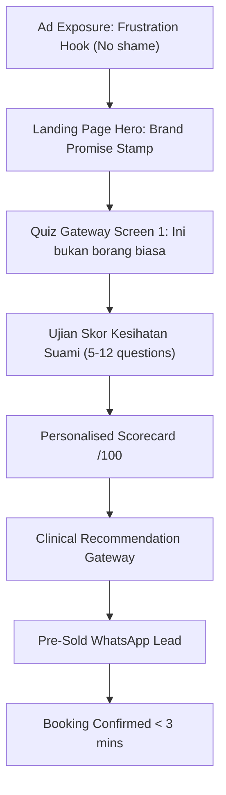

# Diagnostic Funnel — "Ujian Skor Kesihatan Suami"

**Document ID:** `SSC-FNL-001`
**Entity:** SuamiSihat Clinic Sdn. Bhd.
**Confidentiality:** Internal Design System Reference
**Governing Strategy:** [SSC-STR-001 — Clinic Brand Positioning](https://assets.suamisihat.myds.me/doc/?doc=clinic-positioning)
**Living Web Reference:** `https://assets.suamisihat.myds.me/doc/?doc=diagnostic-funnel`

---

## Overview: Diagnostic-First as Brand Identity

The Formaloo diagnostic quiz is not a lead generation form — it is SuamiSihat's most powerful competitive differentiator and the physical embodiment of the clinic's core brand promise:

> **"Kami Tak Jual Rawatan. Kami Cari Punca."**
> *(We don't sell treatments. We find the root cause.)*

Every competing clinic (HeMedical, Universal, MHC Malaysia) pushes patients directly to WhatsApp or a booking form. SuamiSihat is the **only Malaysian men's health clinic** that gates treatment with a clinical diagnostic assessment before recommending any plan.

This is Gap 04 in the SSC-STR-001 Competitor Intelligence — **Diagnostic-First Brand Infrastructure** — and it must be protected, strengthened, and consistently positioned across all touchpoints.

---

## Official Quiz Name & Positioning

| Element | Standard |
| :--- | :--- |
| **Official Name** | Ujian Skor Kesihatan Suami |
| **English Equivalent** | Husband Health Score Assessment |
| **Platform** | Formaloo (formaloo.com) |
| **Score Format** | Personalised score out of 100 |
| **Entry Copy (Screen 1)** | *"Ini bukan borang biasa. Ini pemeriksaan awal anda."* |
| **CTA Label** | *"Mulakan Ujian Saya"* (not *"Submit"*, not *"Register"*, not *"Book Now"*) |
| **Tone** | Clinical empathy. Brotherly, not clinical/cold. Non-judgmental. |

---

## Prohibited Copy Elements in the Quiz Gateway

The quiz onboarding copy must **never** use:

| ❌ Prohibited | Rationale |
| :--- | :--- |
| *"Mati pucuk?"* as an opener | Shame-trigger; violates Brand Voice Standards |
| *"Daftar sekarang!"* / *"Cepat!"* | Urgency-scarcity manipulation; incompatible with diagnostic-first positioning |
| *"Isi borang ini"* | Frames it as administrative paperwork, not a clinical assessment |
| *"Dapatkan konsultasi percuma"* | Positions the quiz as a free-consultation bait, not a genuine assessment |
| Price/package mention before diagnostic | Violates the core *"Check Dulu. Rawat Dengan Tepat."* brand promise |

---

## Approved Entry Copy Suite

### Screen 1 — Gateway Headline
> **"Ini bukan borang biasa."**
> **"Ini pemeriksaan awal anda."**
>
> *Ramai lelaki yang datang ke klinik lain dah habis ribuan ringgit tapi tak jadi — sebab tiada siapa check apa yang sebenarnya tak kena.*
> *Di sini, kita check dulu. Baru kita rawat.*

### Screen 1 — Subheading (English variant)
> **"This isn't a form. It's your clinical starting point."**
> *Answer honestly. No judgement. Your results are private and reviewed only by our medical team.*

### WhatsApp Pre-Quiz CTA
> *"Sebelum kami boleh cadangkan rawatan yang sesuai, kami perlukan gambaran lengkap kesihatan tuan dahulu. Sila lengkapkan Ujian Skor Kesihatan Suami kami — ambil masa 5 minit sahaja."*
> *[Link ke Ujian]*

### Post-Quiz Autoresponder (Score Received)
> *"Terima kasih, [Name]. Kami telah terima keputusan Ujian Skor Kesihatan Suami tuan."*
>
> *"Pasukan doktor kami sedang menganalisis profil tuan. Kami akan hubungi tuan dalam masa 24 jam untuk membincangkan pelan rawatan yang paling sesuai untuk tuan — customized, personalized."*
>
> *"Kita check dulu. Baru kita rawat. — Pasukan SuamiSihat Clinic"*

---

## Funnel Architecture

```
TOUCHPOINT SEQUENCE: Diagnostic-First Patient Journey

[1. AD EXPOSURE]
   Meta/Google Ad: "Dah habis ribuan tapi tak jadi?"
   Hook validates frustration. No shame. No procedure push.
        |
        v
[2. LANDING PAGE HERO]
   "Check Dulu. Rawat Dengan Tepat. Tiada Janji Palsu."
   3-point brand promise visible above the fold.
   Single CTA: "Mulakan Ujian Skor Kesihatan Suami Anda"
        |
        v
[3. QUIZ GATEWAY -- SCREEN 1]
   "Ini bukan borang biasa. Ini pemeriksaan awal anda."
   Sets clinical frame. Removes transactional expectation.
        |
        v
[4. UJIAN SKOR KESIHATAN SUAMI -- 5-12 Diagnostic Questions]
   Questions cover: Vitality, Sleep, Stamina, Libido, Stress, Diet, History
   NO price/package questions at this stage
        |
        v
[5. PERSONALISED SCORECARD -- /100]
   Immediate result page. Shows score. Explains what it means.
   No hard-sell. Medical framing: "Your body is signalling..."
        |
        v
[6. CLINICAL RECOMMENDATION GATEWAY]
   "Based on your score, our doctors recommend..."
   Soft CTA to book a proper diagnostic consultation.
   WhatsApp pre-filled with score reference.
        |
        v
[7. SALES CONVERSATION -- PRE-SOLD LEAD]
   Lead arrives knowing the process. Sales team says:
   "Kami dah tengok skor tuan. Jom kita duduk check sama-sama."
   Booking confirmed in < 3 minutes.
```

---

## Mermaid Funnel Flow



---

## Color & Design Token Standards for Quiz UI

The Formaloo quiz should use approved SuamiSihat™ design tokens:

| Token | Hex | Usage |
| :--- | :--- | :--- |
| `--ss-navy` | `#0F4C75` | Primary background (60%) |
| `--ss-gold` | `#F4A261` | CTA buttons, progress bar accent (10%) |
| `--ss-white` | `#FFFFFF` | Card surfaces, question containers (30%) |
| `--ss-sky-100` | `#E8F3FC` | Input field backgrounds, soft section dividers |

**Typography:** Use `Inter` or `Outfit` (aligned with Design System tokens). Avoid condensed sans-serif fonts.

---

## Funnel Metrics (Benchmarks to Track)

| Metric | Baseline Target | Notes |
| :--- | :--- | :--- |
| Quiz completion rate | > 65% | If below, simplify screen 1 entry copy |
| Quiz-to-WhatsApp conversion | > 40% | Scorecard CTA effectiveness |
| Lead-to-booking conversion | > 25% | Pre-sold leads convert faster |
| Sales call duration | < 5 minutes | Brand Chorus success indicator |
| Price objection rate | < 15% | Decreases as Brand Chorus matures |

---

## Vault Cross-References

- **Governing Strategy:** [[SSC-STR-001 — SuamiSihat Clinic Brand Positioning & Branding Strategy]] — Section 3 (Gap 04), Section 7 (Playbooks), Section 8 (Brand Chorus)
- **Brand Voice Rules:** [Brand Voice & Editorial Standards](https://assets.suamisihat.myds.me/doc/?doc=brand-voice)
- **Design System Doc:** [SS Clinic Sub-Brand](https://assets.suamisihat.myds.me/doc/?doc=ss-clinic)
- **Designer Layout Guide:** [[SSC-GUI-001 — Clinic Homepage Designer Guide]] — Section 9.3 (Clinic Positioning)

---

*SuamiSihat™ Internal Design System · Document SSC-FNL-001 · Updated September 2026*
