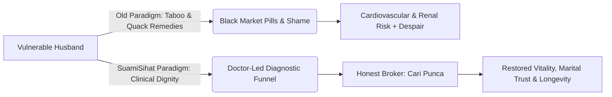
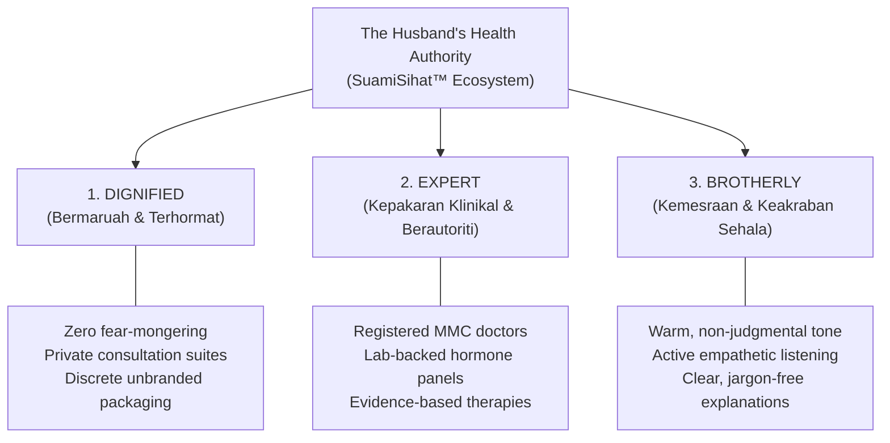

# Vision & Mission — The Husband's Health Authority

**Document ID:** `SS-DS-VM-001`  
**Parent Strategy:** `SSC-STR-001` (SuamiSihat Clinic Master Strategy)  
**Living Web Reference:** [https://assets.suamisihat.myds.me/doc/?doc=vision-mission](https://assets.suamisihat.myds.me/doc/?doc=vision-mission)  
**Governing Standard:** SuamiSihat Design System & Brand Governance  
**Strategic Baseline:** September 2026  

---

> [!IMPORTANT]
> **The Strategic Purpose of This Document**  
> Our vision and mission are not decorative corporate slogans. They serve as the definitive operational and creative filters through which every clinical protocol, patient interaction, architectural space, digital interface, and copy asset is judged. If a creative or clinical asset does not elevate a man's dignity, demonstrate rigorous medical authority, or speak with honest brotherhood, it violates our standard.

---

## 1. Executive Strategic Vision

> **"To be Southeast Asia's most authoritative, trusted, and dignified men's health ecosystem — transforming proactive healthcare from an unspoken vulnerability into a confident, empowered, and masculine lifestyle."**

### 1.1 The Cultural Revolution in Men's Health
For decades across Southeast Asia (and specifically Malaysia), men's sexual and metabolic health has been trapped in the dark shadows of:
1. **Black-market "ubat kuat" and unregulated stimulants** that risk renal failure, sudden cardiovascular collapse, and chronic psychological distress.
2. **Taboo, ridicule, and shame-based fear-mongering**, preventing husbands and fathers from seeking legitimate medical consultation until conditions become irreversible.
3. **Aggressive commercial clinics** that treat vulnerable men as transaction targets—selling invasive RM5,000+ packages without identifying the underlying root cause.

**SuamiSihat exists to dismantle this broken status quo.** We redefine men's healthcare: dismantling the fear of vulnerability, elevating clinical transparency, and giving men the dignified medical sanctuary they deserve.



---

## 2. Core Ecosystem Mission

> **"To empower every touchpoint of the SuamiSihat™ ecosystem with clinical excellence, empathetic dignity, and a rigorous, human-centered design language — ensuring every patient feels respected, understood, and medically secure from first anonymous screening to lifelong vitality."**

### 2.1 Our Living Covenant with Every Patient
When a husband, father, or young professional interacts with SuamiSihat:
- Whether he is taking our **confidential diagnostic quiz** at 1:00 AM from his phone,
- Stepping through the discreet, premium doors of our **physical clinic suites**,
- Receiving his tamper-evident, unmarked medication delivery, or
- Reading our clinical education articles,

He experiences an unwavering standard of care: **unhurried, scientifically unassailable, respectful of his privacy, and profoundly human.**

---

## 3. The 3 Core Pillars of Care

Our positioning as *"The Husband's Health Authority"* is anchored upon three non-negotiable operational and visual pillars:



### Pillar 1: Dignified (Bermaruah & Terhormat)
- **Clinical Reality:** Every consultation is one-on-one, confidential, and completely private. We never display patient identities, queue numbers on public screens, or sensationalized imagery.
- **Design Translation:** Sleek, masculine color palettes dominated by **Prussian Blue (`#022057`)** and warm neutral surfaces. Zero lurid neon highlights, zero sensational red alarm badges, and zero tabloid typography.
- **Tone Translation:** We never use derogatory slang (*"mati pucuk"*, *"lemah syahwat"*, *"loyo"*). We speak with clinical respect (*"disfungsi erektil"*, *"kesihatan vaskular"*, *"keseimbangan hormon"*).

### Pillar 2: Expert (Kepakaran Klinikal & Berautoriti)
- **Clinical Reality:** We are registered medical practitioners governed by the Malaysian Medical Council (MMC) and MOH standards. Every diagnosis is backed by validated blood panels (testosterone, HbA1c, lipid profiles, renal function) and clinical scoring tools (IIEF-5).
- **Design Translation:** Clean, data-driven typography (Outfit & Plus Jakarta Sans), structured comparison tables, crisp visual diagrams, and prominent medical accreditation credentials.
- **Tone Translation:** Decisive, evidence-based, transparent about expected timeframes and realistic physiological outcomes.

### Pillar 3: Brotherly (Kemesraan & Keakraban Sehala)
- **Clinical Reality:** A consultation is not a clinical interrogation. Our physicians and patient concierges act as trusted elder brothers (*"abang yang faham"*)—empathetic, approachable, and non-judgmental.
- **Design Translation:** Generous white space, warm interactive affordances, friendly micro-interactions, and clear visual guidance that alleviates anxiety.
- **Tone Translation:** Malaysian Bahasa and English spoken naturally with authentic warmth (*"Jaga enjin, jaga keluarga"*, *"Kami faham ini bukan topik mudah nak bincang"*).

---

## 4. The "Honest Broker" Philosophy

The cornerstone of SuamiSihat's brand strategy is our **Honest Broker Stance**:

> **"Kami Tak Jual Rawatan. Kami Cari Punca."**  
> *(We don't sell treatments. We find the root cause.)*

In an industry where clinics push high-margin shockwave therapy or injections before running a single blood test, SuamiSihat does the exact opposite. 

Erectile dysfunction and low vitality are rarely isolated mechanical issues—they are frequently early warning signs of metabolic disease, diabetes, cardiovascular compromise, or severe neuro-hormonal exhaustion. 

By prioritizing diagnostic truth over transactional sales:
1. We earn lifelong patient trust and referrals.
2. We prescribe lifestyle changes, weight loss protocols, or basic glycemic control when that is all the patient actually needs.
3. When advanced therapies (ESWT, PDE5 inhibitors, TRT) are indicated, patients embrace them with 100% confidence because they saw the lab data first.

### The 3-Point Brand Promise Stamp
Every clinical touchpoint, campaign, and deliverable is stamped with this contract:

| # | Contract Point | Patient Meaning |
|:---:|:---|:---|
| **1** | **Check Dulu** *(Screen First)* | Complete comprehensive clinical triage & diagnostic lab evaluation before prescribing any therapy. |
| **2** | **Rawat Dengan Tepat** *(Treat Accurately)* | Tailor targeted, evidence-based medical regimens specifically addressing the physiological root cause. |
| **3** | **Tiada Janji Palsu** *(Zero False Promises)* | Absolute transparency on timelines, success rates, and lifestyle obligations. No magic overnight cures. |

---

## 5. Architectural & Design System Translation

Our vision and mission directly govern our **Fluent 2 Design Token Architecture** and the **60:30:10 Visual Hierarchy**:

```
 ┌──────────────────────────────────────────────────────────────────┐
 │ 60% DOMINANT — Prussian Blue (#022057) & Deep Clean Slate       │
 │ Evokes medical authority, institutional stability, and privacy.  │
 ├────────────────────────────────┬─────────────────────────────────┤
 │ 30% SECONDARY — Pure White &  │ 10% FOCAL ACCENT — SS Azure     │
 │ Warm Neutral Surface (#F8FAFC) │ (#21A1F7) & Golden Status       │
 │ Clean clinical breathing room  │ Reserved for primary CTAs,      │
 │ and typographic legibility.    │ active states, & focus rings.   │
 └────────────────────────────────┴─────────────────────────────────┘
```

### Design Token Governance Matrix

| Design Token | Hex Code | Strategic Intent | Application Rule |
|---|---|---|---|
| `--color-brand-prussian` | `#022057` | Executive Governance & Gravitas | Top navigation, dark surfaces, authoritative headers. |
| `--color-brand-blue` | `#043388` | Signature Brand Recognition | Brand badges, secondary buttons, section dividers. |
| `--color-brand-azure` | `#21A1F7` | Action Spark & Forward Momentum | **Strict 10% rule**: Primary CTAs, active tab bars, focus states. Never used for body text on white. |
| `--color-surface-bg` | `#F8FAFC` | Sanitary & Modern Clinical Space | Page background, cards, reading canvases. |
| `--color-text-primary` | `#0F172A` | AAA Reading Contrast (13:1) | Primary headings, body copy, clinical tables. |
| `--color-text-brand` | `#043388` | High-Contrast Brand Emphasis | Project IDs, uppercase eyebrow tags, technical labels. |

---

## 6. Living Ecosystem Touchpoint Alignment

```mermaid
graph LR
    subgraph "1. Awareness & Screening"
        T1["Diagnostic Funnel<br/>(Formaloo 7-Step Quiz)"]
        T2["Educational Social Copy<br/>(Zero Symptom Shame)"]
    end
    
    subgraph "2. Clinical Consultation"
        T3["Discreet Clinic Suites<br/>(Subang Jaya & Kota Bharu)"]
        T4["Doctor-Patient Consultation<br/>(Brotherly & Authoritative)"]
    end
    
    subgraph "3. Treatment & Delivery"
        T5["Tailored Medical Regimen<br/>(Lab-Verified Diagnostics)"]
        T6["Unbranded Discreet Dispatch<br/>(Tamper-Proof Seal)"]
    end
    
    subgraph "4. Continuity of Care"
        T7["Longitudinal Health Tracking<br/>(SS-CAM / Patient Portal)"]
        T8["Lifestyle Coaching & Community"]
    end

    T1 --> T2 --> T3 --> T4 --> T5 --> T6 --> T7 --> T8
```



---

## 7. Strategic Cross-References & Master Guides

To ensure complete systemic harmony, review the following companion documents in the SuamiSihat living ecosystem:

- **[Clinic Brand Positioning (`/doc/?doc=clinic-positioning`)](/doc/?doc=clinic-positioning)** — The complete competitor breakdown, White Space opportunity, and tagline hierarchy (`SSC-STR-001`).
- **[Brand Voice & Tone Standards (`/doc/?doc=brand-voice`)](/doc/?doc=brand-voice)** — The prohibited copy lexicon, approved Malaysian Bahasa copy, and WhatsApp consultation scripts.
- **[Diagnostic Funnel Architecture (`/doc/?doc=diagnostic-funnel`)](/doc/?doc=diagnostic-funnel)** — The 7-step screening funnel protocol, completion benchmarks, and copy suite (`SSC-FNL-001`).
- **[Fluent 2 Design Tokens (`/doc/?doc=brand-fluent2`)](/doc/?doc=brand-fluent2)** — The formal token contracts and visual system primitives.
- **[Colour Composition Standard (`/doc/?doc=color-composition-guide`)](/doc/?doc=color-composition-guide)** — The 60:30:10 rule, contrast matrix, and accessibility compliance.

---

*For inquiries regarding brand governance, clinical design integration, or strategic ecosystem alignment, contact [branding@suamisihat.com](mailto:branding@suamisihat.com).*